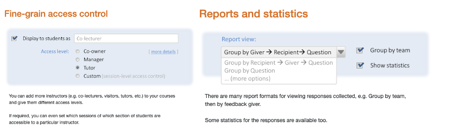
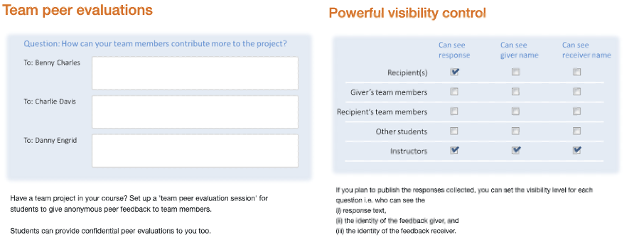

# TEAMMATES Developer Web Site

[](https://github.com/TEAMMATES/teammates/actions)
[](https://github.com/TEAMMATES/teammates/actions)
[](https://codecov.io/gh/TEAMMATES/teammates)
[](LICENSE)


TEAMMATES is a free online tool for managing peer evaluations and other feedback paths of your students.
It is provided as a cloud-based service for educators/students and is currently used by hundreds of universities across the world. 

## Table of Contents

- [Product overview](#Product-overview)
- [Quickstart](#Quickstart)
- [Documentation for developers](#Documentation-for-developers)
- [Contributing to TEAMMATES](#Contributing-to-TEAMMATES)
- [Acknowledgements](#Acknowledgements)
- [Contact us](#Contacting-us)


### Product overview

Product website: [TEAMMATES.com](https://teammates.github.io/teammates/)

Features: [Product key features](https://teammates.github.io/teammates/)

- View, edit, and search student records
- Add, create, and enroll students/instructors 
- View, change, and delete students/instructors
- Manage and archive courses.
- And more [features](https://teammates.github.io/teammates/)





### Quickstart

This project uses MarkBind for developer documentation. MarkBind is used to create a static site, and can parse markdown, GitHub Flavoured Markdown, and more.

All the commands in this document are assumed to be run from the /docs folder, unless specified otherwise.

**Installation**

1. Install Node.js (minimum version 12).
2. Run npm ci to install the necessary tools to build documentation.

Install the following additional dependencies required by MarkBind to generate PlantUML diagrams locally:

1. Install Java 8 or later.
2. Install Graphviz v2.38 (or later).

> You can also use a globally installed MarkBind if you have one. Make sure to use version 3.*.*.

**Run**

Run the following command to view the site locally:
```bash
npm run serve

#Alternative if you wish to use a globally installed MarkBind
markbind serve
```

The live preview will be available at localhost:8080 by default and should update automatically to reflect changes you make to the docs. If you wish to use another port (e.g. 8090), use the -p flag as follows:

```bash
npm run serve -- -p 8090
markbind serve -p 8090
```

### Documentation for developers

Click [here](https://teammates.github.io/teammates/) to view the FULL documentation for developers in details.

1. [Environment Setup](https://teammates.github.io/teammates/setting-up.html) 
2. [Development Guideline](https://teammates.github.io/teammates/development.html)
3. [Development Workflow](https://teammates.github.io/teammates/process.html)
3. [Troubleshoot Guide](https://teammates.github.io/teammates/troubleshooting-guide.html)
3. [Software Design](https://teammates.github.io/teammates/design.html) - Architecture, APIs, etc
4. [TEAMMATES Glossary](https://teammates.github.io/teammates/design.html) 


### Contributing to TEAMMATES

We welcome contributions from developers, especially students. 

> #### [Please follow these steps to contribute](https://teammates.github.io/teammates/contributing-doc.html).

### Acknowledgements

> #### [TEAMMATES team wishes to thank the following invaluable contributions](https://teammatesv4.appspot.com/web/front/about).


### Contacting us

The best way to contact us is to [post a message in our issue tracker](https://github.com/TEAMMATES/teammates/issues/new). Our issue tracker doubles as a discussion forum. You can use it for things like asking questions about the project or requesting technical help.

Alternatively (less preferred), you can email us at teammates@comp.nus.edu.sg.

Blog: Visit the [TEAMMATES Blog](http://teammatesonline.blogspot.com/) to see our latest updates and information.