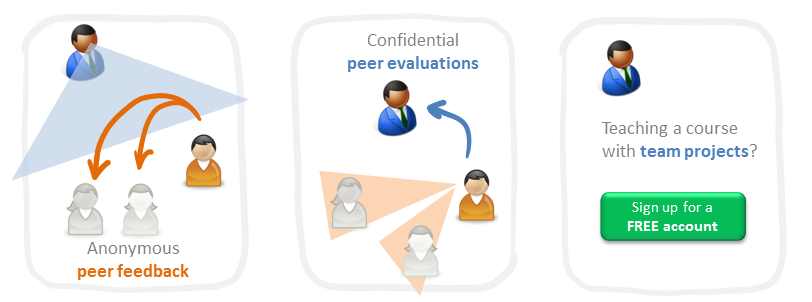

# TEAMMATES Developer Web Site

TEAMMATES is a free online tool for managing peer evaluations and other feedback paths of your students.
It is provided as a cloud-based service for educators/students and is currently used by hundreds of universities across the world.

This is the developer web site for TEAMMATES. **Click [here](http://teammatesv4.appspot.com/) to go to the TEAMMATES product website.**

[**Documentation for Developers** :book:](docs/README.md) |
[Version History](https://github.com/TEAMMATES/teammates/milestones?direction=desc&sort=due_date&state=closed) |
[Project Stats](https://www.openhub.net/p/teammatesonline)

## Interested to join TEAMMATES developer team?

We welcome contributions from developers, especially students. Here are some resources:
* [**Contributor Orientation Guide**](docs/orientation-guide.md): This document describes what you need to know/do to become a contributor.
* [**Project ideas page**](https://docs.google.com/document/d/1fAvYvQr0E93OsZgyneaXGX0jaMA-zptTIxqLn83xwN0/pub?embedded=true): These are for those who would like to do a relatively bigger projects with TEAMMATES (e.g. summer internships).
* [**Instructions for Google Summer of Code applicants**](https://docs.google.com/document/d/1Iu63WRIw8uz8liEW089IQHDQTRbh-QoOLMyfTPXNOa0/pub?embedded=true): Read this before you apply to work for TEAMMATES under GSoC.

## Acknowledgements

TEAMMATES team wishes to thank the following invaluable contributions:
* [**School of Computing, National University of Singapore (NUS)**](http://www.comp.nus.edu.sg), for providing us with the infrastructure support to run the project.
* [**Centre for Development of Teaching and Learning (CDTL)**](http://www.cdtl.nus.edu.sg/) of NUS, for supporting us with several *Teaching Enhancement Grants* over the years.
* **Learning Innovation Fund-Technology (LIF-T)** initiative of NUS, for funding us for the 2015-2018 period.
* **Google Summer of Code** Program, for including TEAMMATES as a mentor organization in *GSoC2014*, *GSoC2015*, *GSoC2016*, and *GSoC2017* editions.
* **Facebook Open Academy** Program, for including TEAMMATES as a mentor organization in FBOA 2016.
* **Jet Brains**, for the [Intellij IDEA](https://www.jetbrains.com/idea/) licences
* [**YourKit LLC**](ttps://www.yourkit.com), for providing us with free licenses for the [YourKit Java Profiler ](https://www.yourkit.com/java/profiler/index.jsp) (an industry leading profiler tool for Java applications).

## Contacting us

The best way to contact us is to [post a message in our issue tracker](https://github.com/TEAMMATES/teammates/issues/new). Our issue tracker doubles as a discussion forum. You can use it for things like asking questions about the project or requesting technical help.

Alternatively (less preferred), you can email us at **teammates@comp.nus.edu.sg**.
