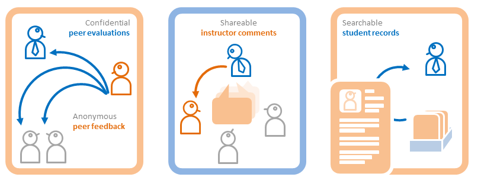

# TEAMMATES

TEAMMATES is a free online tool for managing peer evaluations and other feedback paths of your students.

It is provided as a cloud-based service for educators/students and is currently used by hundreds of universities across the world.

This is the TEAMMATES GitHub code repository for contributors and developers. **If you are an educator or student looking to use TEAMMATES, visit the [product website](https://teammatesv4.appspot.com).**

[**Documentation for Developers** :book:](https://teammates.github.io/teammates) |
[Version History](https://github.com/TEAMMATES/teammates/releases) |
[Project Stats](https://www.openhub.net/p/teammatesonline)

## Get Involved

We welcome contributions from developers of all backgrounds, especially students. See our [developer documentation](https://teammates.github.io/teammates) to get started.

## Acknowledgements

TEAMMATES team wishes to thank the following invaluable contributions:

- [**School of Computing, National University of Singapore (NUS)**](http://www.comp.nus.edu.sg), for providing us with the infrastructure support to run the project.
- [**Centre for Development of Teaching and Learning (CDTL)**](https://nus.edu.sg/cdtl) of NUS, for supporting us with several _Teaching Enhancement Grants_ over the years.
- **Learning Innovation Fund-Technology (LIF-T)** initiative of NUS, for funding us for the 2015-2018 period.
- **Google Summer of Code** Program, for including TEAMMATES as a mentor organization in _GSoC2014_, _GSoC2015_, _GSoC2016_, _GSoC2017_ and _GSoC2018_ editions.
- **Facebook Open Academy** Program, for including TEAMMATES as a mentor organization in FBOA 2016.
- **Jet Brains**, for the [Intellij IDEA](https://www.jetbrains.com/idea/) licences
-  [**YourKit LLC**](https://www.yourkit.com), for providing us with free licenses for the [YourKit Java Profiler](https://www.yourkit.com/java/profiler) (an industry leading profiler tool for Java applications).
-  [**SauceLabs**](https://saucelabs.com), for providing us with a free [Open Sauce account](https://saucelabs.com/open-source) for cross-browser testing.

## Contacting us

- **Found a bug or have a feature request?** [Open an issue](https://github.com/TEAMMATES/teammates/issues) on GitHub.
- **Have a question?** Start a [GitHub Discussion](https://github.com/TEAMMATES/teammates/discussions) (preferred), or email us at [teammates@comp.nus.edu.sg](mailto:teammates@comp.nus.edu.sg) for confidential enquiries.
