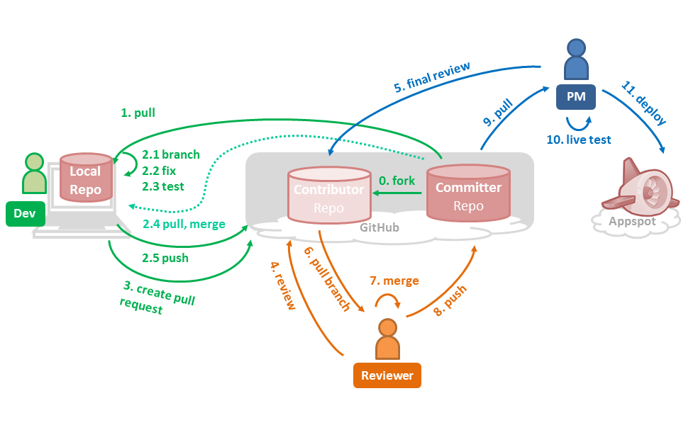
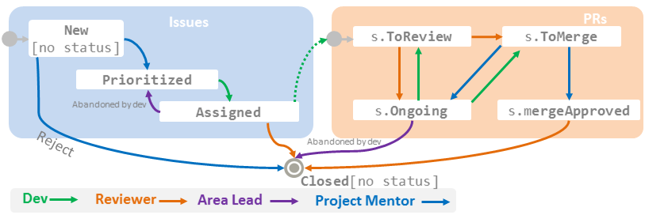

#TEAMMATES Development Process

##Roles and Positions
**Roles**:
* `Dev` - Issue owner who fixes the issue. 
* `Reviewer` - Assigned per issue. Usually, a core team member.
* `Release Lead` (RL) - Responsible for the release management.
* `Project Manager` (PM) - General project coordination and deploying to the live server.

Note: *Roles* are related to the development process and they are different from *Positions*, which relate to
the organization structure of the TEAMMATES dev community. 

**Positions** (in the order of increasing seniority): 
* `Contributor`
* `Committer`
* `Snr Developer`
* `Area Lead`
* `Project Lead`
* `Project Advisor`

Those who are at the rank of `Committer` or above are considered a core member if they are 'active'. 
An *active* member is someone who contributes to almost every release cycle, thereby helping to maintain the 
project velocity. An active member is expected to *pledge* at least one issue to each release, at the beginning of 
the release cycle. They are also strongly encouraged to pick at least one high priority issue for each release cycle. 

## Naming conventions
* For pull request titles, refer to [creating a pull request](#creating-a-pull-request)
* For branch names, refer to [creating a branch](#creating-a-branch)

##Workflow



###Fixing Issues

Role: Dev

{If you need any help regarding the workflow, please [post a new issue in our issue tracker] 
(https://github.com/TEAMMATES/teammates/issues/new) (Yes, our issue tracker doubles as a discussion board).}

This workflow is an adaptation of the [GitHub flow](https://guides.github.com/introduction/flow/index.jsp).

1. Select an issue to handle. If you are a contributor, there is no need to get the issue assigned to you. <br>
   (If you are a committer, assign the issue to yourself and assign it a milestone).

2. Optionally, you can discuss alternative solutions before choosing one to implement. 
   This can be done through Issue tracker. 
   Such a discussion reduces the chance of the fix being rejected later.

3. If the issue is assigned to you, a Pull Request (PR) is expected to be opened for it within a week. 
   Inactivity for a longer time may result in the issue being un-assigned so that
   someone else can work on it.

4. Add remote names for committer repo (let's call it `upstream`)
   ```
   git remote add   upstream      https://github.com/TEAMMATES/repo.git
   ```

5. Update your local repo (the one you created when setting up the project on your computer) 
   with the latest version of the code from the committer repo.
   ```
   git pull upstream master
   ``` 

7. <a name="creating-a-branch"></a>Start a new branch named `{IssueNumber}-{some-keywords}`.
   If you are already working in a branch, remember to switch to the `master` 
   before creating the new branch. e.g.,
    ```
    //switch to master (if not already on the master)
    git checkout master
    //create new branch and switch to it at the same time e.g. git checkout -b 2342-remove-println
    git checkout -b {branch-name}
    ```
8. Fix the issue.
   * Have a look at our coding and testing best practices (links given [here]
   (../README.md)) before you start your first issue.
   * Keep in mind that we have 'reference' code that has extra explanatory 
   notes to help new developers. These are listed in the 'Coding Best Practices' document.
   * You may commit as many times as you wish while you are fixing the code. 
       * Push your commits frequently. If you have push privileges, 
         push to the committer repo. If not, push to your fork.
       * Try to keep the branch reasonably clean (e.g. commit at meaningful points)
       * use meaningful commit messages. (e.g. `added tests for the truncate method`) <br>
         Do NOT use the following format for commit messages. 
         That format is reserved for merge commits only.<br>
         ~~`[Issue number] Issue title as given in the original issue`~~ 
   * Sync with the committer repo frequently: While you were fixing the issue, others 
   might have pushed new code to the committer repo. In that case, update your 
   repo's master branch with any new changes from committer repo and merge those 
   updates to the branch you are working on.
        
       ```
       //switch to master and sync with committer repo
       git checkout master
       git pull upstream master       
       //merge updates into working branch
       git checkout {branch-name}
       git merge master
       ```

   * If there are updates to the dependencies on the build configuration, you should update your local
   copies accordingly. The details on the steps can be found on [this document](dependencies.md).

9. When the work is ready for review:
   * Format the code: Select the code segments you modified and apply the code 
     formatting function of Eclipse (`Source → Format`). 
     This is to ensure that the code is properly formatted. 
     You may tweak the code further to improve readability as auto-format 
     doesn't always result in a good layout.

   * Ensure that the code passes static analysis.
     The details on how to run static analysis locally is given on [this document](staticAnalysis.md).
        
   * Ensure _dev green_ (i.e., all *local* tests are passing on dev server).
     
     Local tests can be run using the "Local Tests" run configuration in Eclipse.

    >If any of the browsertests fail, use [*GodMode*](/devdocs/godmode.md) to fix them. 
    Ensure that dev green is reached without GodMode before submitting for review
     
    >If your new code might behave differently on a remote server than how it 
     behaves on the dev server, ensure those tests are passing against the 
     updated app running on your own GAE staging server.
        
   * Push your branch to the committer repo (push to the fork if you do not 
     have push permission to the committer repo), if you haven't done that already.
   
   * <a name="creating-a-pull-request"></a>Create a pull request (PR). For the pull request name, copy paste
     the relevant issue name and include the issue number as well.<br>
     e.g. ` Incorrect error message when adding an existing instructor #1760`<br>
     In the PR description, mention the issue number in this format: `Fixes #1760`. 
     Doing so will create an automatic reference from the issue to the pull request.<br>

   * Once a PR is opened, the CI server will first run static analysis on the code base.
     If there are problems found, the build will terminate without proceeding to testing.
     Some of the tools will display the cause of the failures in the console; if this is not the case,
     you can run any of the static analysis tools and obtain the reports locally.
     Ensure that the static analysis passes before triggering another CI build.

     Once the code base passes static analysis, the CI server will build and test it. Ensure that the
     build is successful. If the some tests fail, look at the CI log and fix any tests that
     failed. Repeat until all tests pass on the CI server.
     
     If tests fail on the CI server, the CI log will contain the command that will enable running the failing tests locally.
    

   * The PR will be assigned to the reviewer, not to you. 
     Wait for a reviewer to be assigned to the issue.
     Feel free to add a comment asking for a reviewer if a reviewer is not assigned
     within 24 hours.

   * Wait for reviewer to change the PR status to `s.toMerge` 
     or to suggest changes. If you did not get a review within 2 days, 
     it is OK to request for a review by posting a comment in the PR.

   * Once the PR is open, try and complete it within 2 weeks. Inactivity for a 
     longer period would necessitate a restart of the PR.

   * The cycle of 'update pull request' and 'review' is to continue until PR 
     status changes to `s.ToMerge`. After doing suggested changes, 
     remember to add a comment to indicate the PR is ready for review again.
     e.g. `ready to review` or `changes done`<br>
     If you have permissions to change labels, use the `s.ToReview` to indicate
     the PR is ready for review, and the `s.Ongoing` label to indicate the PR
     is not yet ready to be reviewed.

   * As a final check, the PM will look through the changes and either suggest changes (back to `s.Ongoing`),
     or apply the `s.MergeApproved` label to the PR.
   

###Reviewing a fix
Role: reviewer

  * Ensure that the Travis CI build is successful and the developer has local dev green.
  * You are the reviewer for a PR if you are the `assignee` of it.
  * Ensure the following:
    * The solution is the best possible solution to the problem under the 
      circumstances.
    * Tests have been updated to reflect changes to the functional code. Almost 
      all code changes should have changes to both functional code and test code.
    * User documentation has been updated, if required. e.g. help pages.
    * Developer documentation has been updated, if required. e.g. `design.md`
    * The changeset does not contain changes unrelated to the issue. 
      e.g. unnecessary formatting changes.
    * The code is synced with upstream. GitHub should show it as 'can merge'. 
      If not, ask the dev to sync with upstream. 
    * Ensure appropriate header comments and expected standards are followed
      * the standards used in TEAMMATES are available at [Readme](../README.md) under the *Supplementary documents* section
  * If any of the above are not OK, 
    * change the status of the PR to `s.Ongoing`
    * Add comments in the diff to suggest changes.
    * Optionally, add a comment in the conversation thread to inform the author to refine the code.
  * To remove white space changes from being shown, append `?w=1` to url of the `/files` page of the pull request (the "Files changed" tab)
  * If the code is OK on all aspects,
    * Change issue status to `s.ToMerge`

Role: PM

  * Review the code for maintainability and style
  * If the above is not OK,
    * Change the issue status to `s.Ongoing`
  * If the code is OK on all aspects,
    * Change issue status to `s.MergeApproved`


###Applying a fix
Role: dev (with push permission), or reviewer

  * Merging can be done via GitHub. Make sure that GitHub gives a green light for merging.
    There are a few scenarios where GitHub can prevent merging from proceeding:
    * **Merge conflict**: The PR is conflicting with the current `master` branch; the author will
      need to resolve the conflicts before proceeding.
    * **Outdated branch**: The PR is not in sync with the current `master` branch; the author will
      need to sync it before proceeding. This can be done via GitHub with the "Update branch" button.
    
    The dev will need to resolve them before merging can proceed. It is up to the dev/reviewer's discretion
    on whether the merge conflict or outdated branch needs another review to be called for.
    In general, unless the changeset is functionally conflicting, there is no need for another review.
  * When GitHub gives a green light for merging,
    * Checkout to the PR branch, merge with the current `master` branch, and test the code locally by running the "Local tests".<br>
      `git checkout -b 2287-add-sample-course-test origin/2287-add-sample-course-test`<br>
      `git merge master`<br>
    * If green,
      * Merge with "squash and merge" option (preferable). Format of the commit message:<br>
        `[Issue number] Issue title as given in the original issue`<br>
        e.g. `[2287] Add more tests for newly joined Instructor accessing sample course`<br>
        The additional descriptions can be left as is.
      * Optionally, apply an `e.*` label to the issue (not the PR) to indicate 
        the estimated effort required to fix the issue, and another `e.*` label to the PR
        to indicate the estimated effort required to review the PR.
    * If not green,
      * Change the pull request status to `s.Ongoing`.
      * Add a comment to mention the test failure.

###Assigning labels, reviewers, and milestones
Roles: PM (Project Manager) + RL (Release Lead)

PM: Assign priority label and any other missing labels to incoming issues.

RL: 
 * When a new PR comes in, assign a reviewer for the PR. The selection of reviewer
   should be based on the *feature* (`f-`), *aspect* (`a-`), or the *tech* (`t-`) labels 
   of the issue. If there are more than one of these labels, the main category of
   the issue as specified by the *main classifier* (`m.`) label. <br>
   e.g. If the issue has labels `m-Tech` `a-Testing` `t-JS`, the main classifier is 
   `Tech` and therefore the reviewer should be based on the `t-JS` label.<br>
   Once you have figured out which label determines the reviewer, you can find the 
   *Lead* of the label in the [Issue Labels section](#issue-labels).
 * Try to load balance when assigning reviewers. 
 * Assign the current+1 milestone to the corresponding issue. This gives the 
   dev at least a week to finish the PR. 
    
###Making a release
Roles: PM + RL

RL: 
  * Release day - 3: 
    * Post a comment on ongoing PRs of the current milestone to remind the
      dev/reviewer to finish by the release date.
  * Release day:
    * Get dev green for `master`.
    * Merge to `release` branch, tag (Format `V{major}.{minor}.{patch}` e.g. `V5.01.02`.)
    * Inform PM the next version is ready for deployment.
    * Ensure all issues and PRs included in the release are tagged with the 
      correct milestone and the correct assignee.
    * Extend the milestone of issues that slipped the current milestone and post
      a comment asking to finish by next milestone. If an issue is not making
      progress, close the PR and un-assign the issue.
    * Add/revise `e.` labels for the issues/PRs in the release.
    * Ensure all branches merged in the milestone have been deleted.
    * Announce the release on slack and issue tracker.
    * Update `about.jsp` with names of new contributors, if any. Alternatively,
      create an issue to update `about.jsp`.
    * Close the current milestone and create a new milestone for the next+1 release.
    * Create an issue for the next release. Post a comment in that issue to 
      remind active devs who don't have issues scheduled for next release. 
    
  * Release day + 1:
    * Ensure all pending `p.Urgent` issues are assigned and scheduled for next milestone.
    * Ensure all active devs have committed for at least one issue in next milestone.
  
PM: 
  * Pull the latest `release` branch.
  * Get dev green.
  * Deploy.
  * Get live green.
  * Make the version default.
  * Close the 'Release' issue.
     

### Issue/PR Lifecycle


Given above is an illustration of the issue lifecycle. 
Colors indicate which roles are involved in which states/transitions. 

####Issue Labels
The meaning of label group prefixes: 
 * exclusive groups (no more than one of each label group): `s.` status, 
   `p.` priority, `c.` category, `d.` difficulty, `e.` effort, `m.` main classifier
 * non-exclusive groups:  `a-` aspect, `f-` feature, `t-` tech, 
 

**Status**

* Open issues
    * No status: New issue. 
    * `s.Accepted`: Accepted as a valid issue.
    * `s.Ongoing` : The issue is being worked on.
* Open PR  
    * `s.ToReview`: Waiting for the review
    * `s.Ongoing` : The PR is being worked on.
    * `s.ToMerge`: Reviewer accepted the changes. 
    * `s.MergeApproved` : PM has approved the merge. PR ready to be merged.
    * `s.OnHold` : The work on the PR has been put on hold pending some other event.
* Closed issue/PR
    * `s.Discarded` : The PR was abandoned. 

**Priority/Urgency**

* `p.Critical`: Would like to fix it ASAP and release as a hot patch.
* `p.Urgent`: Would like to handle in the very next release.
* `p.High`: Enhances user experience significantly, would like to do in the next few releases.
* `p.Medium`: Marginal impact on user experience.
* `p.Low`: Very little impact, unlikely to do in the near future.
* `p.Zero`: Unlikely to do, ever.

**Category**

* Changes to _functionality_, categorized based on size
  * `c.Enhancement`: An enhancement to an existing functionality (not big enough 
   to be considered as a user story).
  * `c.Story`: A user story.
  * `c.Epic`: A feature that is worth many user stories.
* Other work
  * `c.Bug`
  * `c.Task`: Other work items such as updating documentation.
  * `c.Message` : Issue used as a means of discussing something with the deve team.
     e.g. a request for help on setting up dev environment.

**Difficulty**

* `d.FirstTimers`: Easy. To do as the first issue for new developers. One developer
  should not do more than one of these. Not to be applied for issues with a priority `p.high` or above.
* `d.Contributors`: Moderate difficulty. Small localized change. Can be done by contributors.
  Not to be applied for issues with a priority `p.high` or above.
* `d.Committers`: More difficult issues that are better left for committers or more senior developers.

**Effort**

This label is used to indicate how much effort is expected for (or was spent on)
an issue.

`e.1` is roughly equal to an hour of work, `e.2` is two hours of work, and so on.

**Main classifier**

This label is used to determine whether the `a-`, `f-`, or `t-` label 
(described below) is used to determine the issue leader (i.e. the area lead 
in charge of the issue). 

* `m.Feature` : The owner of the `f-` label is the issue leader. The issue should 
  have exactly one `f-` label. If there is no `m.` label, `m.Feature` is assumed. 
* `m.Aspect` : The owner of the `a-` label is the issue leader. The issue should 
  have exactly one `a-` label.
* `m.Tech` : The owner of the `t-` label is the issue leader. The issue should 
  have exactly one `t-` label.

**Aspect**

Classifies the issues based on the non-functional aspect it tackles. 

|Label             | Lead      | Co-Leads  | Description
|------------------|-----------|-----------|------------------------------------
|`a-AccessControl` |Tania      |           |Controlling access to user groups, authentication, privacy, anonymity
|`a-CodeQuality`   |Wilson     |           |Refactorings that are mainly to improve code/design quality
|`a-Concurrency`   |Khanh      |           |Things related to concurrent access, session control
|`a-DevOps`        |Wilson     |Thyagesh   |CI, release management, version control, dev docs
|`a-Docs`          |Jun Hao    |           |Website, user docs
|`a-FaultTolerance`|Josephine  |Hong Jin   |Resilience to user errors, environmental problems
|`a-Performance`   |Khanh      |           |Speed of operation
|`a-Persistence`   |WeiLin     |Khanh      |Database layer, GAE datastore
|`a-Scalability`   |Khanh      |           |Related to behavior at increasing loads
|`a-Security`      |Tania      |           |Protection from security threats
|`a-Testing`       |Wilson     |           |Testing efficiency and robustness (as opposed to testing a specific feature)
|`a-UIX`           |Josephine  |           |User interface, User experience, Responsiveness

**Feature**

Classifies the issue based on the feature it involves.

|Label       | Lead      | Co-Leads   | Description                             
|------------|-----------|------------|-----------------------------------------
|`f-Admin`   |Khanh      |            |Features used by Admin users 
|`f-Comments`|Josephine  |            |Comments
|`f-Courses` |Josephine  |You Jun     |Courses, Instructors, Students, Home page
|`f-Email`   |Tania      |            |Code related to sending emails
|`f-Profiles`|Josephine  |            |User profiles 
|`f-Results` |Wilson     |            |Session results, moderation, download
|`f-Search`  |Tania      |            |Search
|`f-Submissions`|You Jun |Jun Hao     |Session creation, editing, submissions


**Tech**
classifies the issue based on the technology it involves.

|Label    | Lead         | Co-Leads           | Description                                
|---------|--------------|--------------------|---------------------------------
|`t-CSS`  |Josephine     |                    |CSS, Bootstrap
|`t-GAE`  |Hong Jin      |Khanh               |Google App Engine related technologies such as task queues
|`t-HTML` |Wilson        |                    |HTML, Browsers
|`t-JS`   |Khanh         |                    |Javascript, JQuery
|`t-JSTL` |You Jun       |Tania               |JSTL, JSP, Servlets


