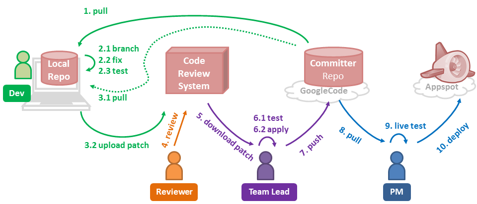
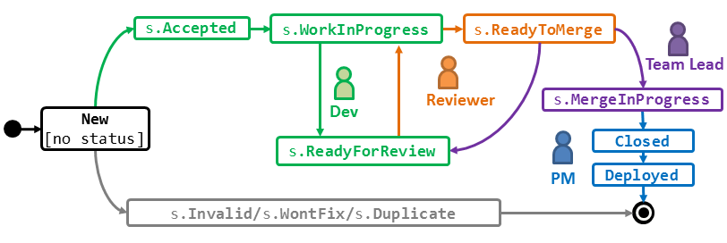

#TEAMMATES Development Process

##Roles
* `Dev` - Issue owner who fixes the issue. 
* `Reviewer` - Assigned per issue. Usually, a core team member.
* `Release Lead` (RL) - Responsible for the release management.
* `Project Manager` (PM) - General project coordination and deploying to the live server.

Note: *Roles* are related to the development process and they are different from *Positions*, which relate to
the organization structure of the TEAMMATES dev community. 
The Positions are: `Contributor`, `Committer`, `Snr Developer`, `Area Lead`, `Project Lead`, `Project Advisor`.

##Workflow



###Fixing Issues

Role: Dev

{If you need any help regarding the workflow, please post in the 
[teammates-contributors Google group](https://groups.google.com/forum/?fromgroups#!forum/teammates-contributors) .}

This workflow is an adaptation of the [GitHub flow](https://guides.github.com/introduction/flow/index.html).

1. Select an issue to handle. ~~Get it assigned to you. 
   Contributors can request for an issue to be assigned to you by posting a comment under the issue in concern.~~

2. Optionally, you can discuss alternative solutions before choosing one to implement. 
   This can be done through Issue tracker. 
   Such a discussion reduces the chance of the fix being rejected later.

3. If the issue is assigned to you, a Pull Request (PR) has to be opened for it within a week. 
   Inactivity for a longer time would open up the issue for others to work on.

4. Add remote names for committer repo (let's call it `upstream`)
   ```
   git remote add   upstream      https://github.com/TEAMMATES/repo.git
   ```

5. Update your local repo (the one you created when setting up the project on your computer) 
   with the latest version of the code from the committer repo.
   ```
   git pull upstream master
   ```
6. If you have permissions to change labels, change the issue status to `s.Ongoing`. 

7. Start a new branch named `{IssueNumber}-{some-keywords}`. 
   If you are already working in a branch, remember to switch to the `master` 
   before creating the new branch. e.g.,
    ```
    //switch to master (if not already on the master)
    git checkout master
    //create new branch and switch to it at the same time e.g. git checkout -b 2342-remove-println
    git checkout -b {branch-name}
    ```
8. Fix the issue.
   * Have a look at our coding and testing best practices (links given [here]
   (../README.md)) before you start your first issue.
   * Keep in mind that we have 'reference' code that has extra explanatory 
   notes to help new developers. These are listed in the 'Coding Best Practices' document.
   * You may commit as many times as you wish while you are fixing the code. 
       * Push your commits frequently. If you have push privileges, 
         push to the committer repo. If not, push to your fork.
       * Try to keep the branch reasonably clean (e.g. commit at meaningful points)
       * use meaningful commit messages. (e.g. `added tests for the truncate method`) <br>
         Do NOT use the following format for commit messages. 
         That format is reserved for merge commits only.<br>
         ~~`[Issue number] Issue title as given in the original issue`~~ 
   * Sync with the committer repo frequently: While you were fixing the issue, others 
   might have pushed new code to the committer repo. In that case, update your 
   repo's master branch with any new changes from committer repo and merge those 
   updates to the branch you are working on.
        
       ```
       //switch to master and sync with committer repo
       git checkout master
       git pull upstream master       
       //merge updates into working branch
       git checkout {branch-name}
       git merge master
       ```

9. When the work is ready for review:
   * Format the code: Select the code segments you modified and apply the code 
     formatting function of Eclipse (`Source → Format`). 
     This is to ensure that the code is properly formatted. 
     You may tweak the code further to improve readability as auto-format 
     doesn't always result in a good layout.
        
   * Ensure _dev green_ (i.e., all tests are passing on dev server).

    >If any of the browsertests fail, use [*GodMode*](/devdocs/godmode.md) to fix them. Ensure that dev green is reached without GodMode before submitting for review
     
    >If your new code might behave differently on a remote server than how it 
     behaves on the dev server, ensure staging green 
     (i.e., all tests are passing against the modified app running on your own 
     GAE staging server).
        
   * Push your branch to the committer repo (push to the fork if you do not 
     have push permission to the committer repo), if you haven't done that already.
   
   * Create a pull request (PR). For the pull request name, copy paste the relevant
     issue name.<br>
     e.g. ` Incorrect error message when adding an existing instructor #1760`<br>
     In the PR description, mention the issue number in this format: `Fixes #1760`. 
     Doing so will create an automatic reference from the issue to the pull request.<br>
     
   * The PR will be assigned to the reviewer, not to you.
     Wait for the reviewer to change the PR status to `s.toMerge` or to suggest changes. 
     If you did not get a review within 2-3 days, it is OK to request for a review 
     by posting a comment in the PR. 

   * Once the PR is open, try and complete it within 2 weeks. Inactivity for a longer period would necessitate a restart of the PR.

   * The cycle of 'update pull request' and 'review' (i.e. the previous two steps) 
     is to continue until PR status changes to `s.toMerge`. After doing suggested
     changes, remember to add a comment to indicate the PR is ready for review again.
     e.g. `ready to review` or `changes done`

   * As a final check, the PM will look through the changes and either suggest changes (back to `s.Ongoing`),
     or apply the `s.mergeApproved` label to the PR.
   

###Reviewing a fix
Role: reviewer

  * This is a code quality review. No need to run tests.
  * You are the reviewer for a PR if you are the `assignee` of it.
  * Ensure the following:
    * The solution is the best possible solution to the problem under the 
      circumstances.
    * Tests have been updated to reflect changes to the functional code. Almost 
    all code changes should have changes to both functional code and test code.
    * User documentation has been updated, if required. e.g. help pages.
    * Developer documentation has been updated, if required. e.g. `design.md`
    * The changeset does not contain changes unrelated to the issue. 
    e.g. unnecessary formatting changes.
    * The code is synced with upstream. GitHub should show it as 'can merge'. 
      If not, ask the dev to sync with upstream. 
    * Ensure appropriate header comments and expected standards are followed
      * the standards used in TEAMMATES are available at [Readme](../README.md) under the *Supplementary documents* section
  * If any of the above are not OK, 
    * change the status of the PR to `s.Ongoing`
    * Add comments in the diff to suggest changes.
    * Optionally, add a comment in the conversation thread to inform the author to refine the code.
  * To remove white space changes from being shown, append `?w=1` to url of the `/files` page of the pull request (the "Files changed" tab)
  * If the code is OK on all aspects,
    * Change issue status to `s.ToMerge`

Role: PM

  * Review the code for maintainability and style
  * If the above is not OK,
    * Change the issue status to `s.Ongoing`
  * If the code is OK on all aspects,
    * Change issue status to `s.mergeApproved`


###Applying a fix
Role: committer

  * Do not merge online. Always merge locally and push to the repo. If you 
    merge online, you will not have a way to test the code first.
  * Format of the commit message: `[Issue number] Issue title as given in the original issue`<br>
    e.g. `[2287] Add more tests for newly joined Instructor accessing sample course`
  * Fetch code from upstream: <br>
    `git fetch origin`<br>
  * Checkout the branch and update with latest master<br>
    `git checkout -b 2287-add-sample-course-test origin/2287-add-sample-course-test`<br>
    `git merge master` <br>
  * Test the code. 
  * If green, 
    * Merge to master and push.<br>
      `git checkout master` <br>
       Merge the branch. Format of the commit message: 
       `[Issue number] Issue title as given in the original issue`<br>
       e.g. `[2287] Add more tests for newly joined Instructor accessing sample course`
    * Remove any status labels from the pull request. Delete the branch (from GitHub UI).
    * Remove any status labels from the corresponding issue and close it.
  * If not green,
    * Delete the merge commit, if any.
    * Change the pull request status to `s.Ongoing`
    * Add a comment to mention the test failure.
  
    
###Making a release
Roles: PM (Project Manager) + RL (Release Lead)

RL: 
  * Get dev green for `master`.
  * Merge to `release` branch, tag (Format `V{major}.{minor}.{build}` e.g. `V5.01.02`.)
  * Inform PM the next version is ready for deployment.
  
PM: 
  * Pull the latest `release` branch.
  * Get dev green.
  * Deploy.
  * Get live green.
  * Make the version default.
  * Inform RL the new version is live.
 
RL:
  * Merge `release` to `master`.  
  * Update milestone.
    * State the release number in the milestone notes.
    * Ensure all issues and PRs included in the release are tagged with the correct milestone.
    * Close the milestone.
  * Announce release to dev and contributor groups.
  * Housekeeping:
    * Post comment in open PRs to request closure by next milestone.
    * Close PRs that have been inactive in spite of reminders.
    * Update `about.html` with names of new contributors, if any.
  * Plan next release.
    * Get active developers to commit to at least 1 issue for the next milestone.
    * Ensure all pending `p.urgent` are assigned and scheduled for next milestone.

### Issue/PR Lifecycle


Given above is an illustration of the issue lifecycle. 
Colors indicate which roles are involved in which states/transitions. 

####Issue Labels
The meaning of label group prefixes: 
 * exclusive groups (no more than one of each label group): `s.` status, 
   `p.` priority, `c.` category, `d.` difficulty, `m.` main classifier
 * non-exclusive groups:  `a-` aspect, `f-` feature, `t-` tech, 
 

**Status**

* Open issues
    * No status: New issue. 
    * `s.Accepted`: Accepted as a valid issue.
    * `s.Ongoing` : The issue is being worked on.
* Open PR  
    * `s.ToReview`: Waiting for the review
    * `s.Ongoing` : The PR is being worked on.
    * `s.ToMerge`: Reviewer accepted the changes. 
    * `s.MergeApproved` : PM has approved the merge. PR ready to be merged.
    * `s.OnHold` : The work on the PR has been put on hold pending some other event.
* Closed issue/PR
    * No status label

**Priority/Urgency**

* `p.Critical`: Would like to fix it ASAP and release as a hot patch.
* `p.Urgent`: Would like to handle in the very next release.
* `p.High`: Enhances user experience significantly, would like to do in the next few releases.
* `p.Medium`: Marginal impact on user experience.
* `p.Low`: Very little impact, unlikely to do in the near future.
* `p.Zero`: Unlikely to do, ever.

**Category**

* Changes to _functionality_, categorized based on size
  * `c.Enhancement`: An enhancement to an existing functionality (not big enough 
   to be considered as a user story).
  * `c.Story`: A user story.
  * `c.Epic`: A feature that is worth many user stories.
* Other work
  * `c.Bug`
  * `c.Task`: Other work items such as updating documentation.

**Difficulty**

* `d.FirstTimers`: Easy. To do as the first issue for new developers. One developer
  should not do more than one of these. Not to be applied for issues with a priority `p.high` or above.
* `d.Contributors`: Moderate difficulty. Small localized change. Can be done by contributors.
  Not to be applied for issues with a priority `p.high` or above.
* `d.Committers`: More difficult issues that are better left for committers or more senior developers.

**Main classifier**

This label is used to determine whether the `a-`, `f-`, or `t-` label 
(described below) is used to determine the issue leader (i.e. the area lead 
in charge of the issue). 

* `m.Feature` : The owner of the `f-` label is the issue leader. The issue should 
  have exactly one `f-` label. If there is no `m.` label, `m.Feature` is assumed. 
* `m.Aspect` : The owner of the `a-` label is the issue leader. The issue should 
  have exactly one `a-` label.
* `m.Tech` : The owner of the `t-` label is the issue leader. The issue should 
  have exactly one `t-` label.

**Aspect**

Classifies the issues based on the non-functional aspect it tackles. 

|Label             | Lead      | Co-Leads  | Description
|------------------|-----------|-----------|------------------------------------
|`a-AccessControl` |Tania      |           |Controlling access to user groups, authentication, privacy, anonymity
|`a-CodeQuality`   |Wilson     |           |Refactorings that are mainly to improve code/design quality
|`a-Concurrency`   |           |           |Things related to concurrent access, session control
|`a-DevOps`        |Wilson     |           |CI, release management, version control, dev docs
|`a-Docs`          |Jun Hao    |           |Website, user docs
|`a-FaultTolerance`|           |           |Resilience to user errors, environmental problems
|`a-Performance`   |           |           |Speed of operation
|`a-Persistence`   |WeiLin     |           |Database layer, GAE datastore
|`a-Scalability`   |Khanh      |           |Related to behavior at increasing loads
|`a-Security`      |           |           |Protection from security threats
|`a-Testing`       |Wilson     |           |Testing efficiency and robustness (as opposed to testing a specific feature)
|`a-UIX`           |Josephine  |           |User interface, User experience, Responsiveness

**Feature**

Classifies the issue based on the feature it involves.

|Label       | Lead      | Co-Leads   | Description                             
|------------|-----------|------------|-----------------------------------------
|`f-Admin`   |Khanh      |            |Features used by Admin users 
|`f-Comments`|Josephine  |            |Comments
|`f-Courses` |Josephine  |You Jun     |Courses, Instructors, Students, Home page
|`f-Email`   |Tania      |            |Code related to sending emails
|`f-Profiles`|Josephine  |            |User profiles 
|`f-Results` |Wilson     |            |Session results, moderation, download
|`f-Search`  |Tania      |            |Search
|`f-Submissions`|You Jun |Jun Hao     |Session creation, editing, submissions


**Tech**
classifies the issue based on the technology it involves.

|Label    | Lead         | Co-Leads           | Description                                
|---------|--------------|--------------------|---------------------------------
|`t-CSS`  |              |                    |CSS, Bootstrap
|`t-GAE`  |              |                    |Google App Engine related technologies such as task queues
|`t-HTML` |              |                    |HTML, Browsers
|`t-JS`   |              |                    |Javascript, JQuery
|`t-JSTL` |              |                    |JSTL, JSP, Servlets


