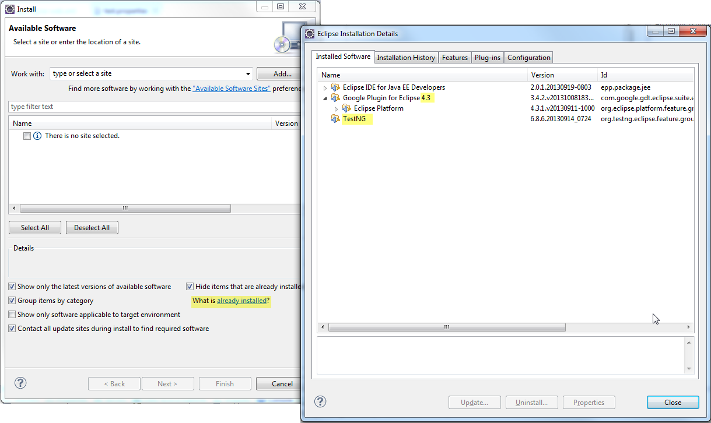
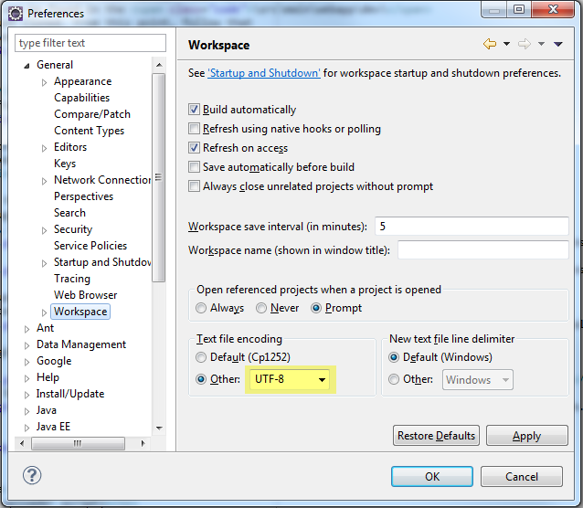
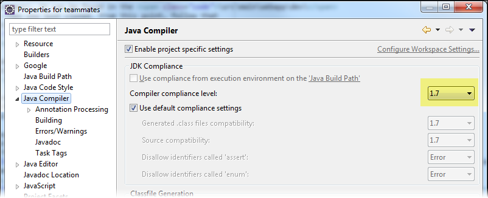
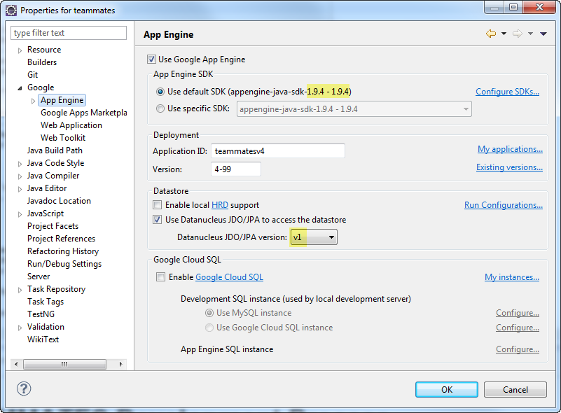
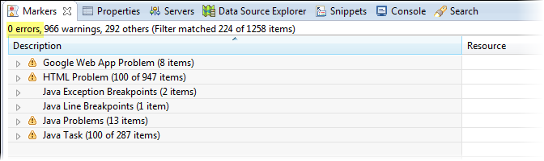
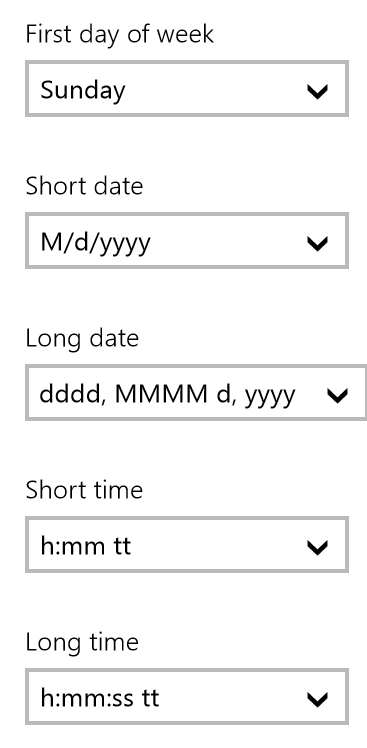

# Developer Troubleshooting Guide

1. [Troubleshooting project setup](#troubleshooting-project-setup)
    * [Setup checklist](#setup-checklist)
    * [Common setup errors and solutions](#common-setup-errors-and-solutions)
2. [Troubleshooting test failures](#troubleshooting-test-failures)
    * [Optimizing IDE layout for testing](#optimizing-ide-layout-for-testing)
    * [How automated browser tests work](#how-automated-browser-tests-work)
    * [Getting help to resolve test failures](#getting-help-to-resolve-test-failures)
    * [Common test errors and solutions](#common-test-errors-and-solutions)

This document can help you to fix the problems encountered while contributing to TEAMMATES. Failing that, you can [post in the issue tracker](https://github.com/TEAMMATES/teammates/issues/new) to ask for help. Remember to supply as much relevant information as possible when asking for help. e.g. Which operating system are you using.

## Troubleshooting project setup

### Setup checklist

Use this checklist to verify that your project setup is correct.

1. **Undo any automatic setting changes done by Eclipse**

    Make sure Eclipse hasn't modified any settings/files during set up. Run git status to ensure the repo is same as the one you cloned from GitHub. If there are any changes, do an git reset --hard and restart Eclipse.

2. **Check the version of the Google plugin for Eclipse**

    In Eclipse, go to Help → Install new software → What's already installed

    Ensure that Google Plugin version is `4.3 or 4.4` and TestNG is installed.

    

3. **Check the text encoding settings**

    Window → Preferences → General → Workspace

    

4. **Check the JDK compatibility**

    Project → Properties → Java Compiler

    

5. **Check the SDK version**
   ```
    Note : We are using version 1.9.27 instead of 1.9.4
   ```
    Project → Properties → Google → App Engine

    

6. **Check for compilation errors**

    Markers tab should have 0 errors. Warnings are generally fine to be ignored.

    

    If it shows errors, try refreshing the project (right-click on the project in Project explorer) followed by a Project → Clean.

### Common setup errors and solutions

1. **ERROR**: Eclipse complains about FileWriter and ConsoleHandler e.g. java.io.FileWriter is not supported by Google App Engine's Java runtime environment.

  **SOLUTION**: These are OK because the offending files belong to test driver and will not be deployed to GAE. Choose to "Quick Fix" and then choose to exclude those files from validation.

2. **ERROR**: Eclipse complains "...your project must be configured to use a JDK in order to use JSP".

  **SOLUTION**: This happens because Eclipse is only aware of JRE, not JDK (Compiling JSP requires the JDK). 
  
   Go to Window → Preferences → Java → Installed JREs. 
   
   You will note that a JRE path is the one selected, not a JDK path. To fix this, Click add → Standard VM, then for the JRE Path enter the path of the JRE folder inside your JDK installation folder. e.g., C:/jdk1.7/jre Now you should see all of the JARs added to the library section.

3. **ERROR**: When trying to deploy, Eclipse complains "... Cannot get the System Java Compiler. Please use a JDK, not a JRE.".

  **SOLUTION**: You can force Eclipse to use the JDK (instead of JRE) by modifying the eclipse.ini file. See [here](http://stackoverflow.com/questions/13913019/changing-jdk-in-eclipse) for more details.

4. **ERROR (on Windows)**: Dev server launched by Eclipse keeps running even after closing Eclipse. After restarting Eclipse, you'll be able to relaunch dev server on the same port but requests will be received by the previous server instance.

  **SOLUTION**: If Eclipse crashes while development server is running inside Eclipse, the server might keep running even after Eclipse is closed. Go to Windows Task Manager and kill processes named javaw.exe.

5. **ERROR**: Eclipse complains "file out of sync".

  **SOLUTION**: "Refresh" the project in eclipse.

6. **ERROR**: Eclipse complains "There are no JREs installed in the workplace that are strictly compatible with this environment.".

  **SOLUTION**: Eclipse may be using an incompatible version of the JRE Library (with respect to TEAMMATES) for the current JRE definition. System Library for JRE should be set to the workspace default, after appropriate JRE definition has been added (covered in existing point#2 of the troubleshooting section).
  
   
   Right-click on project → Properties → Java Build Path → "Libraries" tab → Select JRE System Library from the list → Edit… → Select and mark radio button for "Workspace default JRE"
   

7. **ERROR**: Everything seems normal and the dev server starts normally. But you get a "Class not found" or "Class cannot initialize" error when you try to access any non-static pages of the app.

  **SOLUTION**: Check if the build.properties and appengine-web.xml has been renamed properly, which you were supposed to during the set up.

## Troubleshooting test failures

### Optimizing IDE layout for testing

  The default place for the TestNG tab is alongside the Console tab.

  

  Here's a better place for it. Just drag the tab and drop it alongside the Project Explorer tab.

  

### How automated browser tests work

  Our automated Browser tests compare generated Web pages with expected pages (these are in the /src/test/resources/pages folder). Such a test case fails when the expected page does not match the actual page. To see the diff between actual and expected, double click the error message in the TestNG tab.
  
Here is an example (use the zoom feature of the Browser to see details of the screenshot).

  

  Note that you can ignore the following differences reported by Eclipse diff tool. Those are not the cause of the test failure.

 Expected | Actual | Explanation 
 --- | --- | --- 
 `<expected></expected>` | `<actual></actual>` | These are inserted by the test code for easier reference, after the comparison has been done. 
 {*} | Any text | The expression {*} is used to mark a piece of text we cannot predict in advance. e.g. current time. These differences are ignored by our comparison algorithm. 

  Furthermore, you might see tags such as ${test.student1} and ${version} in some of the expected files (e.g. StudentHomeHTML.html) if you open them in Eclipse. The test code will replace those tags with correct values before performing the comparison. For example, ${version} will be replaced by something like V4.89

### Getting help to resolve test failures

Remember to state which tests are failing and for each of those
* The detailed error message (taken from the TestNG tab)

* Any relevant screenshots (e.g. screen shot of the diff window showing the offending difference)

### Common test errors and solutions

1. **ERROR**: Encountered "java.net.ConnectException: Connection refused" when running some tests.

  **SOLUTION**: Ensure that your dev server is started prior to running those tests.

2. **ERROR**: Encountered "org.openqa.selenium.WebDriverException: Unable to bind to locking port 7054 within 45000 ms" when running tests with Browser.

  **SOLUTION**: Ensure compatible version of Firefox is installed as specified under Prerequisites.
  
3. **ERROR**: Tests fail randomly during dev server testing.

  **SOLUTION**: Make sure there is only one dev server running. Eclipse will happily allow you to start multiple dev servers.

  

4. **ERROR (on Windows)**: NullPointerException when trying to access email box. The error message looks something like this:
   ```
      java.lang.NullPointerException at
      javax.mail.internet.ParameterList.set(ParameterList.java:165) at
      com.sun.mail.imap.protocol.BODYSTRUCTURE.parseParameters(BODYSTRUCTURE.java:390)
   ```
  **SOLUTION**: In eclipse, move the javax.mail.....jar (from Oracle) to the top of the build class path.

   (Properties → Java build path → "Order and Export" tab)

5. **ERROR**: Test failure message encountered when running full test suite: "Selenium cannot find Firefox binary in PATH".

  **SOLUTION 1**: Path to Firefox executable on local machine is incorrect. Specify the correct folder in system PATH variable.
  
   Open Windows Explorer → Right-click on Computer → Advanced System Settings → "Advanced" tab → Environment Variables… → Select "PATH" from the list → Add directory of "Mozilla Firefox" folder to "Variable value" field

  **SOLUTION 2**: Incorrect custom path in test.firefox.path. Make sure that the path is set correctly following the example from test.template.properties

6. **ERROR**: After deploying on the staging server, you get an error related to … Unsupported major.minor version ... when trying to access pages of the staged app.

  **SOLUTION**: This can happen if you have Java 8 is installed and Eclipse uses Java 8 during deployment, even if you have already configured the project to use Java 7.
Refer [this page](http://java.wildstartech.com/Java-Platform-Standard-Edition/mac-os-x-java-development/how-to-configure-eclipse-to-run-with-java-7-when-java-8-is-installed) to learn how to modify eclipse.ini to use Java 7 by default.

7. **ERROR**: A handful of failed test cases (<10).

  **SOLUTION**: Re-run the failed tests with TestNG, all test cases should pass eventually (it may take a few runs). If there are tests that persistently fail and not addressed in other parts of this guide, you may [request for help in the issue tracker](https://github.com/TEAMMATES/teammates/issues/new).
  
8. **ERROR**: Browser alert about invalid SSL certificate.

  **SOLUTION**: Ensure that test.app.url in your test.properties uses -dot- instead of '.' when using secondary subdomains.
  Eg. `http://4-30-dot-teammates-john.appspot.com`
9. **ERROR**: Test cases failed due to accented characters.

  **SOLUTION**: Ensure that the text file encoding for your Eclipse workspace has been set to UTF-8 as specified under Prerequisites.
10. **ERROR**: Error message in the console about "incorrect date format".

  **SOLUTION**: Ensure the date format of your computer matches the below. For Windows, [this link](http://www.sevenforums.com/tutorials/3530-time-format-change.html) may be useful.

  

11. **ERROR**:java.lang.UnsupportedClassVersionError when running on staging server.

  **SOLUTION**: This can happen if you have Java 8 installed on your computer. Change Eclipse configuration to use Java 7 instead. Here is a useful [reference]( http://java.wildstartech.com/Java-Platform-Standard-Edition/mac-os-x-java-development/how-to-configure-eclipse-to-run-with-java-7-when-java-8-is-installed).
  

12. **ERROR**: InstructorCourseDetailsPageUiTest fails in production server due to Gmail's access restriction (e.g javax.mail.AuthenticationFailedException)

  **SOLUTION**: "Allow access for less secure apps" for the accounts used in that particular test. As doing so will leave the accounts more vulnerable to security issues, it is strongly recommended that the access is revoked after the test passes. Check for [reference]( https://support.google.com/accounts/answer/6010255?hl=en).

13. **ERROR (on Linux)**: java.io.IOException: Directory "/tmpfiles" could not be created.

   **SOLUTION**: Specify an additional parameter, -Djava.io.tmpdir, in the VM arguments for the tests' run configurations. Add "-Djava.io.tmpdir=/path/to/teammates/tmp". The "tmp" folder in the specified directory needs to be created before running the tests.
