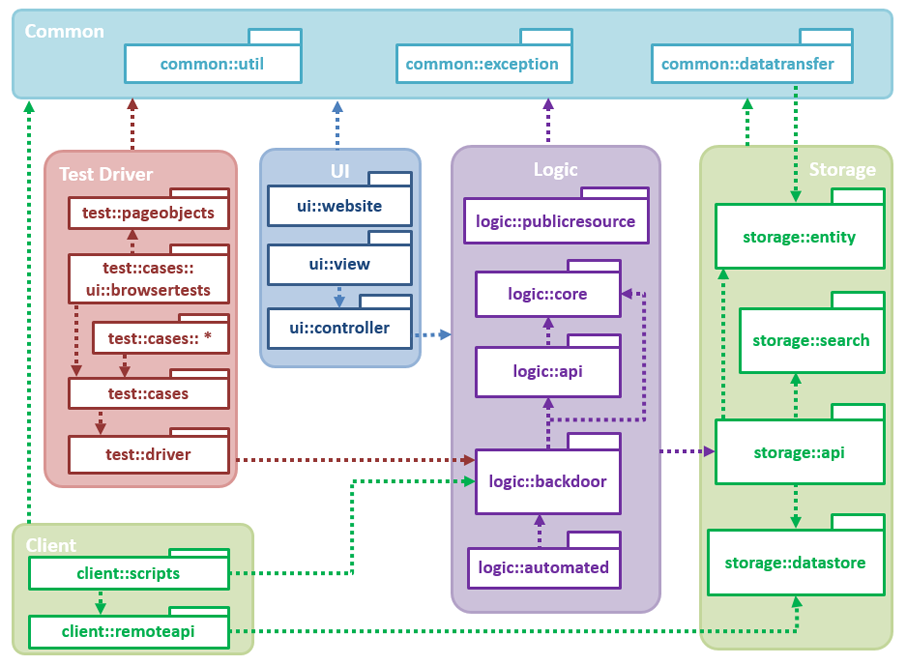
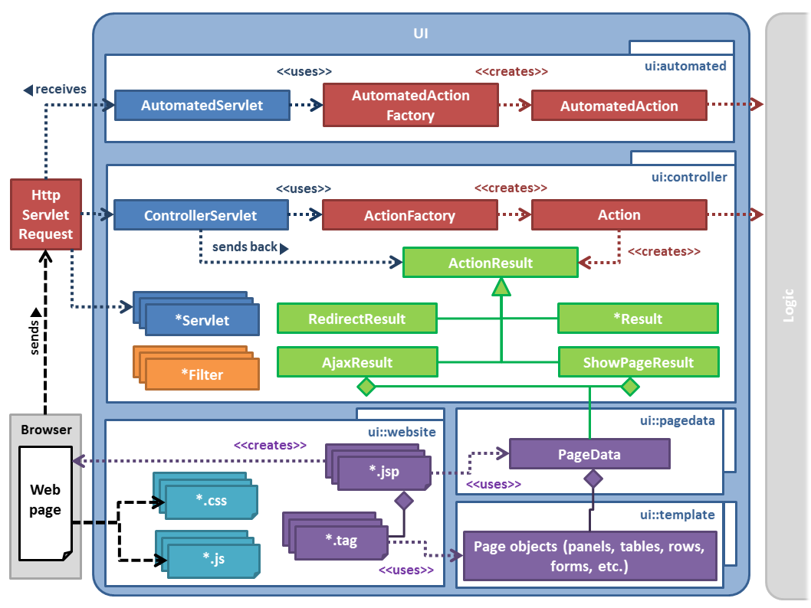
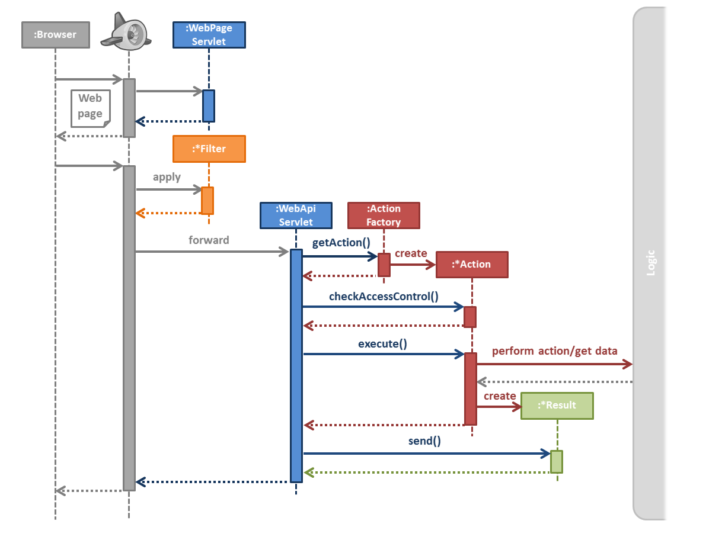
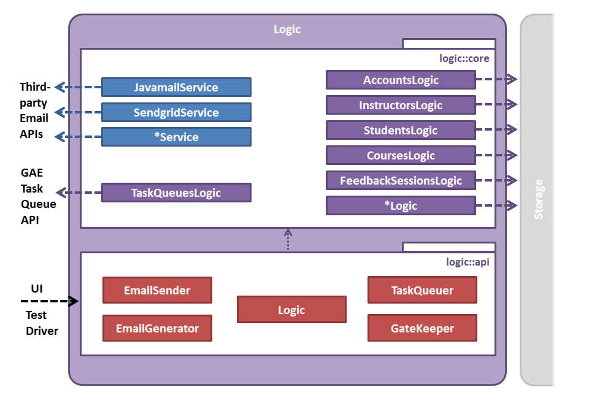
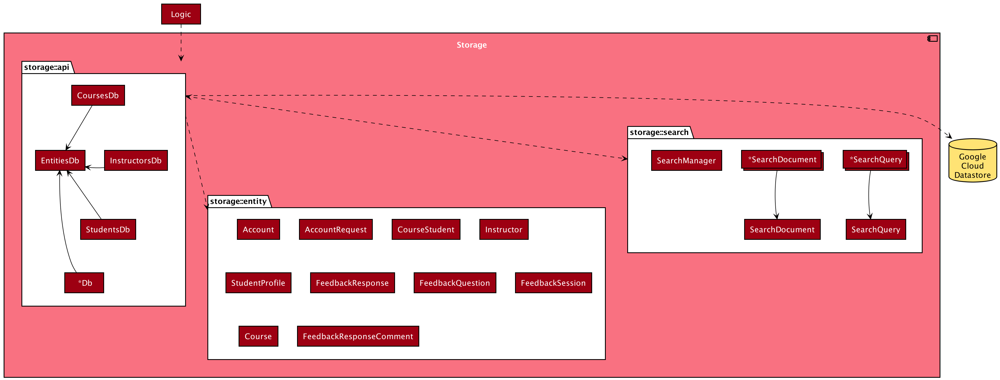
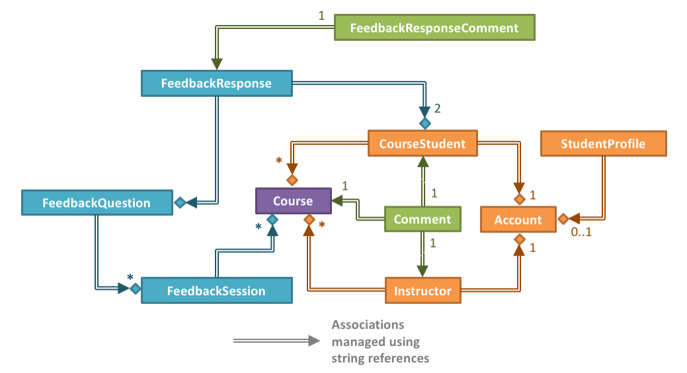
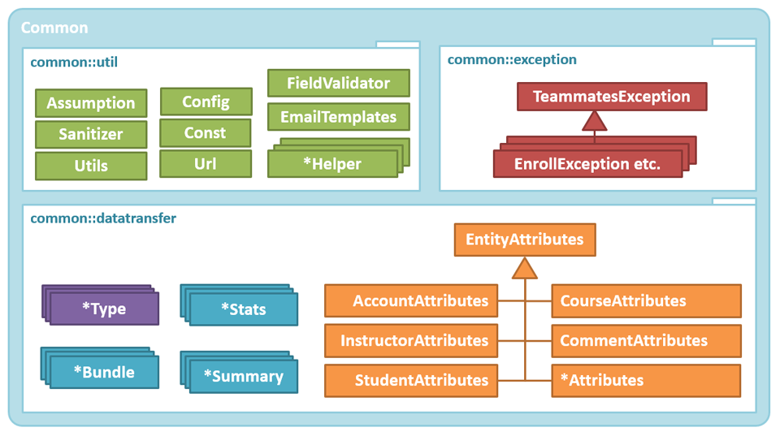
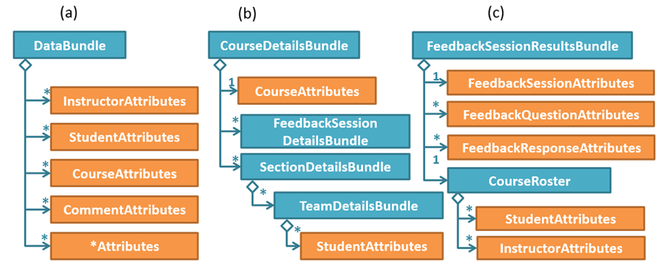
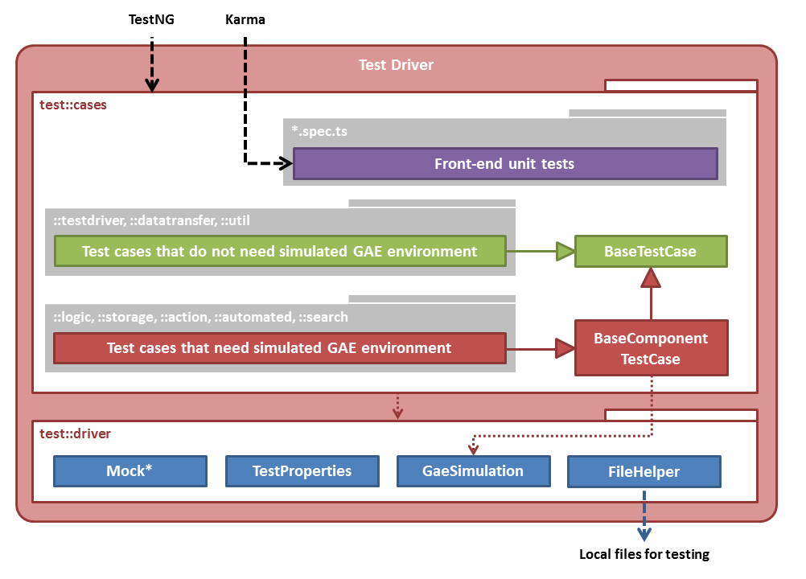

# Design

- [Architecture](#architecture)
- [UI Component](#ui-component)
- [Logic Component](#logic-component)
- [Storage Component](#storage-component)
- [Common Component](#common-component)
- [Test Driver Component](#test-driver-component)
- [Client Component](#client-component)

## Architecture


TEAMMATES is a Web application that runs on Google App Engine (GAE). Given above is an overview of the main components.
- **UI**: The UI seen by users consists of Web pages containing HTML, CSS (for styling) and JavaScript (for client-side interactions such as sorting, input validation etc.). This UI is generated by Java Server Pages (JSP), using the JSP Standard Tag Library (JSTL), and Java Servlets residing on the server. Requests are sent to the server over HTTP. In addition, AJAX (Asynchronous JavaScript And XML) is used (sparingly) to fetch data from the server asynchronously.
- **Logic**: The main logic of the application is in POJOs (Plain Old Java Objects).
- **Storage**: The storage layer of the application uses the persistence framework provided by **GAE Datastore**, a NoSQL database.
- **Test Driver**: TEAMMATES makes heavy use of automated regression testing. This component can access the application directly to set up test data (transmitted using JSON format).
  - `TestNG` is used for Java testing (all levels) and `QUnit` for JavaScript unit-testing.
  - `Selenium WebDriver` is used to automate UI testing with actual Web browsers.
  - `HttpUnit` is used to set up a simulated web server in servlet-level tests, where an actual web server is not required.
- **Client**: The Client component can connect to the back end directly without using a Web browser. It is used for administrative purposes, e.g. migrating data to a new schema.
- **Common**: The Common component contains utility code (data transfer objects, helper classes, etc.) used across the application.

The diagram below shows how the code in each component is organized into packages and the dependencies between them.



Notes:
- `[logic] - [ui::view] - [ui::controller]` represent an application of Model-View-Controller pattern.
  - `ui::view` is not a real package; it is a conceptual package representing the front end of the application.

## UI Component

The diagram below shows the object structure of the UI component.



Notes:
- `ui::pagedata`, `ui::template`, and `ui::website` make up the `ui::view` package as shown in the high-level package diagram.
- `ui::website` is not a Java package. It consists of JSP/JSTL tag, HTML, CSS and JS files.

The UI component is the first stop for 99% of all requests that are received by the application.
Such a request will go through the following steps:

1. Request received by the GAE server.
1. Custom filters are applied according to the order specified in `web.xml`, e.g. `AppstatsFilter`.
1. Request forwarded to a `*Servlet` object as specified in `web.xml` for further processing, depending on the type of request.

There are two general types of requests: user-invoked requests and automated (GAE server-invoked) requests, which are processed differently.

### User-invoked requests

User-invoked requests are all requests made by the users of the application, typically from the Web browser (i.e. by navigating to a particular URL of the application).
About 70% of this type of request results in a web page being shown, for which the request will be processed as follows:



1. Request forwarded to the `ControllerServlet`.
1. `ControllerServlet` uses the `ActionFactory` to generate the matching `Action` object, e.g. `InstructorHomePageAction`.
1. `ControllerServlet` executes the action.
   1. The `Action` object checks the access rights of the user. If the action is allowed, it will be performed, interacting with the `Logic` component as necessary.
   1. The `Action` gathers the data required for the page into a `PageData` object, e.g. `InstructorHomePageData`, creates a `ShowPageResult` object by enclosing the `PageData` object created previously, and returns it to the `ControllerServlet`.
1. `ControllerServlet` sends the result. In case of a `ShowPageResult`, this is equivalent to forwarding to the matching JSP page.
1. The JSP page uses the data in the given `PageData` object to generate the HTML page.
1. The response will then be sent back to the browser, which will render the page.

The other 30% types of request may differ in the following manners:
- At times, the user will request for data asynchronously via AJAX. In such cases, the actions return an `AjaxResult`. `PageData` is also created for this request and the data obtained is pre-processed for display in the browser; that is, the result of the AJAX request is not the raw data.
- After performing certain actions, the browser may load another page (redirects to another page), possibly with the status of the previous action. In such cases, the action returns a `RedirectResult`, which simply instructs the browser to send a fresh request for the specified page. In such cases, no `PageData` object will be generated for the original request.
- Some actions result in downloading a file (e.g. a feedback session report) or displaying an image (e.g. profile picture). In such cases, the result type will be `FileDownloadResult` or `ImageResult`, and no `PageData` object will be generated.
- In some cases, the request is not forwarded to `ControllerServlet`, but to some other `*Servlet` as specified in `web.xml`. In such cases, the request will be processed as specified in those `*Servlet` objects; no common routine is observed in these other `*Servlet` objects.
  - Some requests may not forwarded to any `*Servlet` at all, but rather to a specified resource file of the web application (e.g. JSP files).
  - Requests for static files (e.g. CSS, JS files) are served directly without going through `web.xml` at all.

### Automated requests

Automated requests are all requests sent automatically by the GAE server during specific periods of time.
This type of request will be processed as follows:

1. The source of the request will be checked for administrator privilege. If this privilege is absent (e.g. non-administrator users trying to invoke the automated actions), the request will be dropped and a `403 Forbidden` status will be returned.
   - Requests generated by the GAE server are equipped with this privilege.
   - Administrators can manually invoke these requests; this is particularly useful in testing the actions associated with those requests.
1. Request forwarded to the `AutomatedServlet`.
1. `AutomatedServlet` uses the `AutomatedActionFactory` to generate the matching `AutomatedAction` object, e.g. `CompileLogsAction`.
1. `AutomatedServlet` executes the action.
1. The corresponding `AutomatedAction` will be performed, interacting with the `Logic` component as necessary.

GAE server sends such automated requests through two different configurations:
- Cron jobs: These are jobs that are automatically scheduled for a specified period of time, e.g. scheduling feedback session opening reminders. It is configured in `cron.xml`.
- Task queue workers: These are hybrids of user-invoked and GAE-invoked in that they are queued by users (i.e. users request for the tasks to be added to queue), but executed by GAE (i.e. GAE determines when and which tasks in the queue are executed at any point of time). This is typically used for tasks that may take a long time to finish and can exceed the 1 minute standard request processing limit imposed by GAE. It is configured in `queue.xml` as well as the `TaskQueue` nested class of the [Const](../src/main/java/teammates/common/util/Const.java) class.

### Additional Notes

- Since the high-level workflow of processing a request is same for any request (differing by the two request types only), we use the [Template Method pattern](http://en.wikipedia.org/wiki/Template_method_pattern) to abstract the process flow into the `Action` and `AutomatedAction` classes.
- The list of actions and corresponding URIs are listed in the `ActionURIs` nested class of the [Const](../src/main/java/teammates/common/util/Const.java) class.
- The list of pages and corresponding URIs are listed in the `ViewURIs` nested class of the [Const](../src/main/java/teammates/common/util/Const.java) class.

## Logic Component

The `Logic` component handles the business logic of TEAMMATES. In particular, it is responsible for:
- Managing relationships between entities, e.g. cascade logic for create/update/delete.
- Managing transactions, e.g. ensuring atomicity of a transaction.
- Sanitizing input values received from the UI component.
- Providing a mechanism for checking access control rights.
- Connecting to GAE-provided or third-party APIs, e.g. for adding tasks to the task queue and for sending emails with third-party providers.



Package overview:
- **`logic.api`**: Provides the API of the component to be accessed by the UI.
- **`logic.backdoor`**: Provides a mechanism for the test driver and client scripts to access data.
- **`logic.core`**: Contains the core logic of the system.

### Logic API

Represented by these classes:
- `Logic`: A [Facade class](http://en.wikipedia.org/wiki/Facade_pattern) which connects to the several `*Logic` classes to handle the logic related to various types of data and to access data from the `Storage` component.
- `GateKeeper`: Checks access rights of a user for a given action.
- `EmailGenerator`: Generates emails to be sent.
- `EmailSender`: Sends email with the provider chosen based on the build configuration. It connects to the email provider by using the appropriate `*Service` class.
- `TaskQueuer`: Adds tasks to the task queue. It connects to GAE's task queue API.
- `BackDoorLogic`: For the use of `Test Driver` only. White-box tests are allowed to access this component directly, while black-box tests can access this via `BackDoorServlet`.

### Policies

General:
+ Null values should **not** be used as parameters to this API, except when following the KeepExisting policy (explained later).

Access control:
+ Although this component provides methods to perform access control, the API itself is not access controlled. The UI is expected to check access control (using `GateKeeper` class) before calling a method in the `Logic`.
+ However, calls received by `BackDoorServlet` are authenticated using the 'backdoor key'. Backdoor key is a string known only to the person who deployed the app (typically, the administrator).

API for creating entities:
+ Null parameters: Causes an assertion failure.
+ Invalid parameters: Throws `InvalidParametersException`.
+ Entity already exists: Throws `EntityAlreadyExistsException` (escalated from Storage level).

API for retrieving entities:
+ Attempting to retrieve objects using `null` parameters: Causes an assertion failure.
+ Entity not found:
  - Returns `null` if the target entity not found. This way, read operations can be used easily for checking the existence of an entity.
  - Throws `EntityDoesNotExistsExeption` if a parent entity of a target entity is not found e.g., trying to list students of a non-existent course.

API for updating entities:
+ Primary keys cannot be edited except: `Student.email`.
+ KeepExistingPolicy: the new value of an optional attribute is specified as `null` or set to “Uninitialized”, the existing value will prevail. {This is not a good policy. To be reconsidered}.
+ `Null` parameters: Throws an assertion error if that parameter cannot be null. Optional attributes follow KeepExistingPolicy.
+ Entity not found: Throws `EntityDoesNotExistException`.
+ Invalid parameters: Throws `InvalidParametersException`.

API for deleting entities:
+ `Null` parameters: Not expected. Results in assertion failure.
+ FailDeleteSilentlyPolicy: In general, delete operation do not throw exceptions if the target entity does not exist. Instead, it logs a warning. This is because if it does not exist, it is as good as deleted.
+ Cascade policy:   When a parent entity is deleted, entities that have referential integrity with the deleted entity should also be deleted.
  Refer to the API for the cascade logic.

## Storage Component

The `Storage` component performs CRUD (Create, Read, Update, Delete) operations on data entities individually.
It contains minimal logic beyond what is directly relevant to CRUD operations.
In particular, it is reponsible for:
- Validating data inside entities before creating/updating them, to ensure they are in a valid state.
- Hiding the complexities of datastore from the `Logic` component. All GQL queries are to be contained inside the `Storage` component.
- Protecting persistable objects: Classes in the `storage::entity` package are not visible outside this component to prevent accidental modification to the entity's attributes (these classes have been marked as "persistence capable" and changes to their attributes are automatically persisted to the Datastore by default).
  - Instead, a corresponding non-persistent [data transfer object](http://en.wikipedia.org/wiki/Data_transfer_object) named `*Attributes` (e.g., `CourseAttributes` is the data transfer object for `Course` entities) object is returned, where values can be modified easily without any impact on the persistent data copy. These datatransfer classes are in `common::datatransfer` package, to be explained later.
  - Note: This decision was taken before GAE started supporting [the ability to "detach" entities](https://cloud.google.com/appengine/docs/java/datastore/jdo/creatinggettinganddeletingdata) to prevent accidental modifications to persistable data. The decision to use data transfer objects is to be reconsidered in the future.

The `Storage` component does not perform any cascade delete/create operations. Cascade logic is handled by the `Logic` component.



Package overview:
- **`storage.api`**: Provides the API of the component to be accessed by the logic component.
- **`storage.entity`**: Classes that represent persistable entities.
- **`storage.search`**: Classes for dealing with searching and indexing.



Note that the navigability of the association links between entity objects appear to be in the reverse direction of what we see in a normal OOP design.
This is because we want to keep the data schema flexible so that new entity types can be added later with minimal modifications to existing elements.

### Storage API

Represented by the `*Db` classes. These classes act as the bridge to the GAE Datastore.

### Policies

Add and Delete operations try to wait until data is persisted in the datastore before returning. This is not enough to compensate for eventual consistency involving multiple servers in the GAE production enviornment. However, it is expected to avoid test failures caused by eventual consistency in dev server and reduce such problems in the live server.
Note: 'Eventual consistency' here means it takes some time for a database operation to propagate across all serves of the Google's distributed datastore. As a result, the data may be in an inconsistent states for short periods of time although things should become consistent 'eventually'. For example, an object we deleted may appear to still exist for a short while.

Implementation of Transaction Control has been decided against due to limitations of GAE environment and the nature of our data schema. Please see [TEAMMATES Decision Analysis](https://docs.google.com/document/pub?id=1o6pNPshCp9S31ymHY0beQ1DVafDa1_k_k7bpxZo5GeU&embedded=true) document for more information.

General:
+ If `Null` is passed as a parameter, the corresponding value is **NOT** modified, as per the KeepExistingPolicy that was previously mentioned.

API for creating:
+ Attempt to create an entity that already exists: Throws `EntityAlreadyExistsException`.
+ Attempt to create an entity with invalid data: Throws `InvalidParametersException`.

API for retrieving:
+ Attempt to retrieve an entity that does not exist: Returns `null`.

API for updating:
+ Attempt to update an entity that does not exist: Throws `EntityDoesNotExistException`.
+ Attempt to update an entity with invalid data: Throws `InvalidParametersException`.

API for deleting:
+ Attempt to delete an entity that does not exist: Fails silently.

## Common Component

The Common component contains common utilities used across TEAMMATES.



Package overview:
- **`common.util`**: Contains utility classes.
- **`common.exceptions`**: Contains custom exceptions.
- **`common.datatransfer`**: Contains data transfer objects.

`common.datatransfer` package contains lightweight "data transfer object" classes for transferring data among components. They can be combined in various ways to transfer structured data between components. Given below are three examples.



1. `Test Driver` can use the `DataBundle` in this manner to send an arbitrary number of objects to be persisted in the database.
1. This structure can be used to transfer data of a course (e.g., when constructing the home page for an instructor).
1. This structure can be used to send results of a feedback session (e.g., when showing a feedback session report to an instructor).

Some of these classes are methodless (and thus more of a data structure rather than a class); these classes use public variables for data for easy access.

## Test Driver Component

This component automates the testing of TEAMMATES.



Package overview:
- **`test.driver`**: Contains infrastructure and helpers needed for running the tests.
- **`test.pageobjects`**: Contains abstractions of the pages as they appear on a Browser (i.e. SUTs).
- **`test.cases`**: Contains test cases.
  Sub-packages:
  - **`.testdriver`**: Component test cases for testing the test driver infrastructure and helpers.
  - **`.datatransfer`**: Component test cases for testing the datatransfer objects from the `Common` component.
  - **`.util`**: Component test cases for testing the utility classes from the `Common` component.
  - **`.logic`**: Component test cases for testing the `Logic` component.
  - **`.storage`**: Component test cases for testing the `Storage` component.
  - **`.search`**: Component test cases for testing the search functions.
  - **`.pagedata`**: Component test cases for testing the UI view model.
  - **`.action`**: System test cases for testing the user-invoked actions.
  - **`.automated`**: System test cases for testing the system-automated actions (manually invoked during testing).
  - **`.browsertests`**: Black-box system test cases for testing the application as a whole via the web browser.

Notes:
- Component tests: Some of these are pure unit tests (i.e. testing one component in isolation) while others are integration tests that test units as well as integration of units with each other.
- `AllJsTests.java` (implemented as a browser test) is for unit-testing JavaScript code.

This is how TEAMMATES testing maps to standard types of testing.

```
Normal
|-----acceptance tests-----|-------------------system tests-------------------|-----integration tests-----|-----unit tests-----|
|----------manual testing----------|-----automated browser tests-----|----------------automated component tests----------------|
TEAMMATES
```

## Client Component

The Client component contains scripts that can connect to the application back end for administrative purposes, such as migrating data to a new schema and calculating statistics.

Package overview:

- **`client.remoteapi`**: Classes needed to connect to the back end directly.
- **`client.scripts`**: Scripts that deal with the back end data for administrative purposes.
