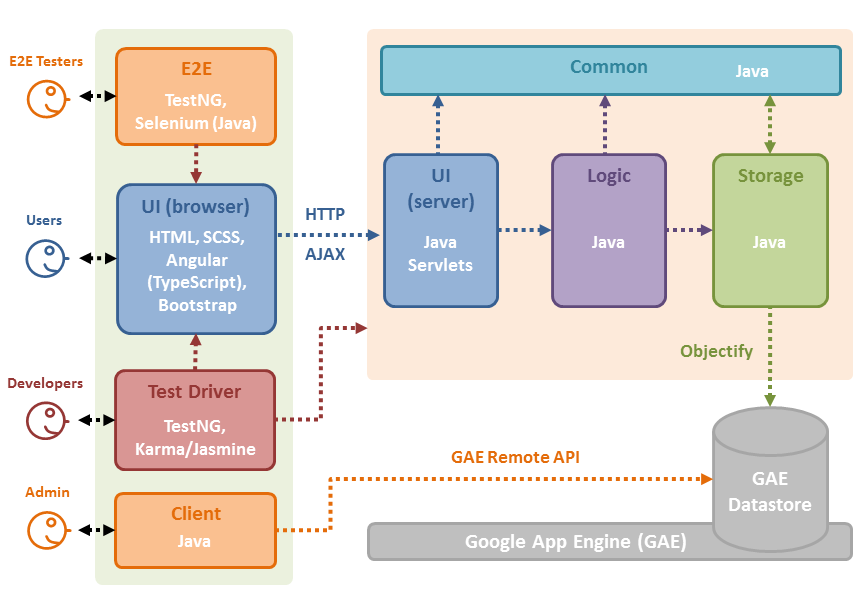

<frontmatter>
  title: "Design"
</frontmatter>

# Design

## Architecture



TEAMMATES is a Web application that runs on Google App Engine (GAE). Given above is an overview of the main components.

- **UI (Browser)**: The UI seen by users consists of Web pages containing HTML, CSS (for styling) and JavaScript (for client-side interactions such as sorting, input validation, etc.). This UI is a single HTML page generated by Angular framework. The initial page request is sent to the server over HTTP, and requests for data are sent asynchronously with AJAX.
- **UI (Server)**: The entry point for the application back end logic is designed as a REST-ful controller.
- **Logic**: The main logic of the application is in POJOs (Plain Old Java Objects).
- **Storage**: The storage layer of the application uses the persistence framework provided by **Google Cloud Datastore**, a NoSQL database.
- **Test Driver**: TEAMMATES makes heavy use of automated regression testing. Test data is transmitted using JSON format.
  - `TestNG` is used for Java testing (all levels) and `Jest` for JavaScript unit-testing.
- **E2E**: The E2E (end-to-end) component is used to interact with the application as a whole with Web browsers. Its primary function is for E2E tests.
  - `Selenium (Java)` is used to automate E2E testing with actual Web browsers.
- **Client**: The Client component can connect to the back end directly without using a Web browser. It is used for administrative purposes, e.g. migrating data to a new schema.
- **Common**: The Common component contains utility code (data transfer objects, helper classes, etc.) used across the application.

The diagram below shows how the code in each component is organized into packages and the dependencies between them.

<puml src="diagrams/packageDiagram.puml"></puml>

Notes:

- `[logic] - [ui::website] - [ui::webapi]` represent an application of `Model-View-Controller` pattern.
  - `ui::website` is not a real package; it is a conceptual package representing the front-end of the application.

## UI Component

The diagram below shows the object structure of the UI component.

<puml src="diagrams/UiComponent.puml"></puml>

Notes:

- `ui::website` is not a Java package. It is written in Angular framework and consists of HTML, SCSS, and TypeScript files. The framework will build those files into HTML, CSS and JavaScript files ready to be used by standard Web browsers.

The UI component is the first stop for 99% of all requests that are received by the application.
Such a request will go through the following steps:

1. Request received by the GAE server.
1. Custom filters are applied according to the order specified in `web.xml`, e.g. `OriginCheckFilter`.
1. Request forwarded to a `*Servlet` object as specified in `web.xml` for further processing, depending on the type of request.

There are two general types of requests: user-invoked requests and automated (GAE server-invoked) requests, which are processed differently.

### User-invoked requests

User-invoked requests are all requests made by the users of the application, typically from the Web browser (i.e. by navigating to a particular URL of the application).
The request will be processed as follows:

<puml src="diagrams/UiWorkflow.puml"></puml>

The initial request for the web page will be processed as follows:

1. Request forwarded to `WebPageServlet`.
1. `WebPageServlet` returns the built single web page (`index.html`).
1. The browser will render the page and execute the page scripts, most of the time requiring AJAX requests to the server.

Subsequent AJAX requests sent to the server will be processed as follows:

1. Request forwarded to the `WebApiServlet`.
1. `WebApiServlet` uses the `ActionFactory` to generate the matching `Action` object, e.g. `GetFeedbackSessionsAction`.
1. `WebApiServlet` executes the action.
   1. The `Action` object checks the access rights of the user. If the action is allowed, it will be performed, interacting with the `Logic` component as necessary.
   1. The `Action` packages and processes the result into an `ActionResult` object. The most common format is `JsonResult` (requests for obtaining data or processing existing data) and other formats are defined as necessary, e.g. `ImageResult` (e.g. profile pictures).
1. `WebApiServlet` sends the result back to the browser which will then process it on the front-end.

Requests for static asset files (e.g. CSS, JS files, images) are served directly without going through `web.xml` configuration at all.

The Web API is protected by two layers of access control check:

- Origin check: This mitigates [CSRF attack](https://owasp.org/www-community/attacks/csrf).
- Authentication and authorization check: This checks if the logged in user (or lack thereof) has sufficient privileges to trigger the API's actions.

Special keys (`csrf key` and `backdoor key`) can be used to bypass each of the checks, typically for testing purpose. Those keys are strings known only to the person who deployed the application (typically, the administrator).

### Automated requests

Automated requests are all requests sent automatically by the GAE server during specific periods of time.
This type of request will be processed as follows:

1. The source of the request will be checked for administrator privilege. If this privilege is absent (e.g. non-administrator users trying to invoke the automated actions), the request will be dropped and a `403 Forbidden` status will be returned.
   - Requests generated by the GAE server are equipped with this privilege.
   - Administrators can manually invoke these requests; this is particularly useful in testing the actions associated with those requests.
1. Request forwarded to the `WebApiServlet` and subsequent actions are the same as user-invoked AJAX requests.

GAE server sends such automated requests through two different configurations:

- Cron jobs: These are jobs that are automatically scheduled for a specified period of time, e.g. scheduling feedback session opening reminders. It is configured in `cron.yaml`.
- Task queue workers: These are hybrids of user-invoked and GAE-invoked in that they are queued by users (i.e. users request for the tasks to be added to queue), but executed by GAE (i.e. GAE determines when and which tasks in the queue are executed at any point of time). This is typically used for tasks that may take a long time to finish and might be blocking user's interaction. It is configured in `queue.yaml` as well as the `TaskQueue` nested class of the [Const](https://github.com/TEAMMATES/teammates/blob/master/src/main/java/teammates/common/util/Const.java) class.

### Template Method pattern

- Since the high-level workflow of processing a request is same for any request (differing by the two request types only), we use the [Template Method pattern](http://en.wikipedia.org/wiki/Template_method_pattern) to abstract the process flow into the `Action` classes.

### Policies

On designing API endpoints (for AJAX requests):

- Design endpoints for resources. For example, `FeedbackSession` is a resource. The corresponding endpoint is `/session`. We use `GET`, `POST`, `PUT`, `DELETE` HTTP methods to get, create, update and delete the resource respectively.
- Prefer multiple REST calls over single RPC (Remote Procedure Call) calls.
  - Reason 1: REST paradigm promotes reuse of many business logic and is not dependent of the structure of the requesting web page (or any other type of requesting agent).
  - Reason 2: Multiple REST calls can be parallelized which will improve performance.
- Separate access control logic and execution logic completely.
  - In the case that an endpoint serves multiple purposes, we use `Intent` to distinguish the intent for the request. For example, instructors can access `/session` with intent `INSTRUCTOR_SUBMISSION` or `FULL_DETAIL`. Some `Intent` will naturally require stricter access rights.
- Prefer HTTP request body over URL parameters (key-value) to contain data for `POST` and `PUT` requests.
  - Reason 1: The URL parameters are used to identify a specific resource for an endpoint, not what should be done to them.
  - Reason 2: Request body is not limited to key-value format which allows proper design and validation.
  - Data Transfer Objects (DTOs) which represent different API requests and responses are defined in `request` and `output` package respectively.
- Preprocess data sent/received by the server to hide complexities. For example, timestamp is passed as UNIX epoch milliseconds in the output while it is represented as `Instant` in the back-end.
  - Some constructors in the `output` package contain logic to hide "hacks" in the backend.
  - Some getters/setters in the `request` package contain logic to cater the conventions in the backend.
  - Some fields are required be hidden in the API response, mostly for data privacy purposes. Whenever required, there should be methods in the request output objects catered for this.
- API endpoints should not be concerned with how data is presented.
  - Case study 1: some endpoint will pass timezone information via two information: timezone ID and UNIX epoch milliseconds. It is up to the front-end on how to make use of those two pieces of information.
  - Case study 2: CSV file for session result or student list is just a different way of presenting the same information in the web page. Due to this, when downloading CSV, the web page will request the same information as that used when displaying in web page and do the necessary conversion to CSV.

On data exchange between front-end and back-end:

- Back-end is the single source of truth for all data format and the code used by front-end is generated from this.
  - Some important constants (including API endpoints information) are synced to `api-const.ts`.
  - The schemas of the DTOs defined in `output` and `request` packages are synced to `api-output.ts` and `api-request.ts` in the frontend.

On handling exceptions:

- The UI component is responsible for catching all exceptions and transforming them to properly formed, user-friendly output format. It includes the status message shown to user as well as the HTTP status code.
  - As a consequence, the UI component cannot throw any exception, because there is no layer which will catch those exceptions if it does.
- In order to streamline the process, custom runtime exception classes which correspond to different HTTP status codes are used. For example, there is `EntityNotFoundException` which corresponds to HTTP 404, `UnauthorizedAccessException` which corresponds to HTTP 403, etc.
  - It is highly preferred to throw these custom exceptions instead of setting the HTTP status manually in the action class, as the API layer has been configured to automatically log the exception and assign the correct status code to the HTTP response.
- All `4XX` responses must be accompanied with logging at `warning` level or above. `5XX` responses must be accompanied with `severe` level logging.
  - `502` (Bad Gateway) responses may skip the `severe` level logging if the upstream components (where the error happened) already did the `severe` level logging.
- We use the HTTP status codes as close to their standard definition in [RFC7231](https://tools.ietf.org/html/rfc7231) as possible.

## Logic Component

The `Logic` component handles the business logic of TEAMMATES. In particular, it is responsible for:

- Managing relationships between entities, e.g. cascade logic for create/update/delete.
- Managing transactions, e.g. ensuring atomicity of a transaction.
- Sanitizing input values received from the UI component.
- Connecting to GCP or third-party services, e.g. for adding tasks to the task queue and for sending emails with third-party providers.

<puml src="diagrams/LogicComponent.puml"></puml>

Package overview:

- **`logic.api`**: Provides the API of the component to be accessed by the UI.
- **`logic.core`**: Contains the core logic of the system.
- **`logic.external`**: Holds the logic of external services such as task queue service.

### Logic API

Represented by these classes:

- `Logic`: A [Facade class](http://en.wikipedia.org/wiki/Facade_pattern) which connects to the several `*Logic` classes to handle the logic related to various types of data and to access data from the `Storage` component.
- `UserProvision`: Retrieves user information (based on request cookies).
- `EmailGenerator`: Generates emails to be sent.
- `EmailSender`: Sends email with the provider chosen based on the build configuration.
- `TaskQueuer`: Adds tasks to the task queue, i.e. to be executed at a later time.
- `FileStorage`: Manages CRUD of binary files such as profile pictures.
- `LogsProcessor`: For more advanced usage of logging that cannot be captured by the standard logger class.
- `RecaptchaVerifier`: For verification of the reCAPTCHA token.

Many classes in this layer make use of proxy pattern, i.e. they only connect to production services such as Google Cloud Storage in the staging/production server.

### Policies

Access control:

+ Although this component provides methods that are relevant to access control (e.g. providing user information), the access control check itself does not happen in this component. The UI is expected to check access control (using `GateKeeper` class) before calling a method in the logic component.

API for creating entities:

+ Null parameters: Causes an assertion failure.
+ Invalid parameters: Throws `InvalidParametersException`.
+ Entity already exists: Throws `EntityAlreadyExistsException` (escalated from Storage level).

API for retrieving entities:

+ Attempting to retrieve objects using `null` parameters: Causes an assertion failure.
+ Entity not found:
  - Returns `null` if the target entity not found. This way, read operations can be used easily for checking the existence of an entity.

API for updating entities:

+ Update is done using `*UpdateOptions` inside every `*Attributes`. The `UpdateOptions` will specify what is used to identify the entity to update and what will be updated.
+ Entity not found: Throws `EntityDoesNotExistException`.
+ Invalid parameters: Throws `InvalidParametersException`.

API for deleting entities:

+ FailDeleteSilentlyPolicy: In general, delete operation do not throw exceptions if the target entity does not exist. This is because if it does not exist, it is as good as deleted.
+ Cascade policy:   When a parent entity is deleted, entities that have referential integrity with the deleted entity should also be deleted.
  Refer to the API for the cascade logic.

## Storage Component

The `Storage` component performs CRUD (Create, Read, Update, Delete) operations on data entities individually.
It contains minimal logic beyond what is directly relevant to CRUD operations.
In particular, it is reponsible for:

- Validating data inside entities before creating/updating them, to ensure they are in a valid state.
- Hiding the complexities of the database from the `Logic` component.
- Hiding the persistable objects: Classes in the `storage::entity` package are not visible outside this component to hide information specific to data persistence.
  - Instead, a corresponding non-persistent [data transfer object](http://en.wikipedia.org/wiki/Data_transfer_object) named `*Attributes` (e.g., `CourseAttributes` is the data transfer object for `Course` entities) object is returned. These datatransfer classes are in `common::datatransfer` package, to be explained later.

The `Storage` component does not perform any cascade delete/create operations. Cascade logic is handled by the `Logic` component.

<puml src="diagrams/StorageComponent.puml"></puml>

Package overview:

+ **`storage.api`**: Provides the API of the component to be accessed by the logic component.
+ **`storage.entity`**: Classes that represent persistable entities.
+ **`storage.search`**: Classes for dealing with searching and indexing.

<puml src="diagrams/StorageClassDiagram.puml"></puml>

Note that the navigability of the association links between entity objects appear to be in the reverse direction of what we see in a normal OOP design.
This is because we want to keep the data schema flexible so that new entity types can be added later with minimal modifications to existing elements.

### Storage API

Represented by the `*Db` classes. These classes act as the bridge to the database.

### Policies

Add and Delete operations try to wait until data is persisted in the database before returning. This is not enough to compensate for eventual consistency involving multiple servers in the Google Cloud Datastore environment. However, it is expected to avoid test failures caused by eventual consistency in dev server and reduce such problems in the live server.
Note: 'Eventual consistency' here means it takes some time for a database operation to propagate across all replicas of the Google Cloud Datastore. As a result, the data may be in an inconsistent states for short periods of time although things should become consistent 'eventually'. For example, an object we deleted may appear to still exist for a short while.

Implementation of Transaction Control has been minimized due to limitations of Google Cloud Datastore environment and the nature of our data schema.

API for creating:

+ Attempt to create an entity that already exists: Throws `EntityAlreadyExistsException`.
+ Attempt to create an entity with invalid data: Throws `InvalidParametersException`.

API for retrieving:

+ Attempt to retrieve an entity that does not exist: Returns `null`.

API for updating:

+ Attempt to update an entity that does not exist: Throws `EntityDoesNotExistException`.
+ Attempt to update an entity with invalid data: Throws `InvalidParametersException`.

API for deleting:

+ Attempt to delete an entity that does not exist: Fails silently.

## Common Component

The Common component contains common utilities used across TEAMMATES.

<puml src="diagrams/CommonComponent.puml"></puml>

Package overview:

- **`common.util`**: Contains utility classes.
- **`common.exceptions`**: Contains custom exceptions.
- **`common.datatransfer`**: Contains data transfer objects.

`common.datatransfer` package contains lightweight "data transfer object" classes for transferring data among components. They can be combined in various ways to transfer structured data between components. Given below are three examples.

<puml src="diagrams/DataTransferClasses.puml"></puml>

1. `Test Driver` can use the `DataBundle` in this manner to send an arbitrary number of objects to be persisted in the database.
1. This structure can be used to transfer search results of a student or instructor or response comments.
1. This structure can be used to send results of a feedback session (e.g., when showing a feedback session report to an instructor).

Some of these classes are methodless (and thus more of a data structure rather than a class); these classes use public variables for data for easy access.

## Test Driver Component

This component automates the testing of TEAMMATES.

<puml src="diagrams/TestDriverComponent.puml"></puml>

The test driver component's package structure follows the corresponding production package structure's exactly,
e.g. `teammates.logic.core.*` will contain the test cases for the production code inside `teammates.logic.core` package.
In the same spirit, for the front end, each `*.component.ts` will have the corresponding `*.component.spec.ts` in the same folder (similarly for `*.service.ts`, `*.pipe.ts`, etc.).

The test driver component introduces the following additional packages:

- **`architecture`**: Contains test cases used by one of the lint tools to check for architectural integrity.
- **`test`**: Contains infrastructure and helpers needed for running the tests. Also contains the test cases for the said infrastructure/helpers.

Notes:

- Component tests: Some of these are pure unit tests (i.e. testing one component in isolation) while others are integration tests that test units as well as integration of units with each other.
- Front-end files (particularly TypeScript) are tested separately with `Jest`. The test cases are found in `*.spec.ts` files.

This is how TEAMMATES testing maps to standard types of testing.

```
Normal
|-----acceptance tests-----|-------------------system tests-------------------|-----integration tests-----|-----unit tests-----|
|--------manual testing--------|------automated E2E tests------|-------------------automated component tests-------------------|
TEAMMATES
```

## E2E Component

The E2E component has no knowledge of the internal workings of the application and can only interact either with Web browser (as a whole application) or REST API calls (for the back-end logic). Its primary function is for E2E tests.

<puml src="diagrams/E2EComponent.puml"></puml>

Package overview:

- **`e2e.util`**: Contains helpers needed for running E2E tests. Also contains the test cases for the said infrastructure/helpers.
- **`e2e.pageobjects`**: Contains abstractions of the pages as they appear on a Browser (i.e. SUTs).
- **`e2e.cases`**: Contains system test cases for testing the application as a whole.

## Client Component

The Client component contains scripts that can connect directly to the application back-end for administrative purposes, such as migrating data to a new schema and calculating statistics.

<puml src="diagrams/ClientComponent.puml"></puml>

Package overview:

- **`client.util`**: Contains helpers needed for client scripts.
- **`client.connector`**: Classes needed to connect to the back end directly.
- **`client.scripts`**: Scripts that deal with the back end data for administrative purposes.
