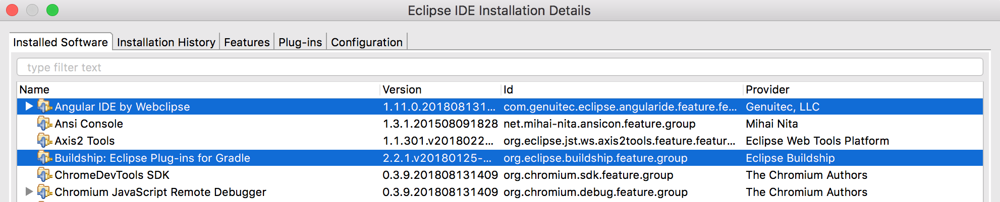
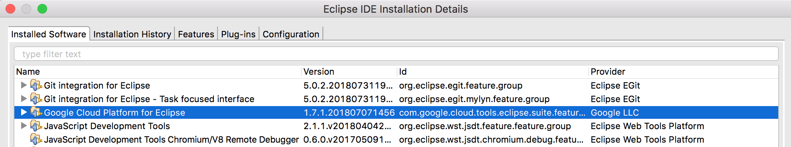
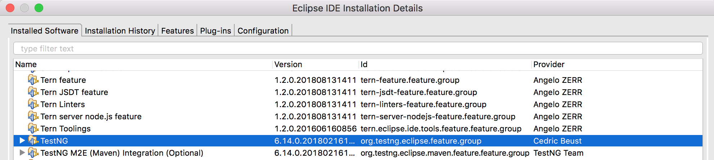
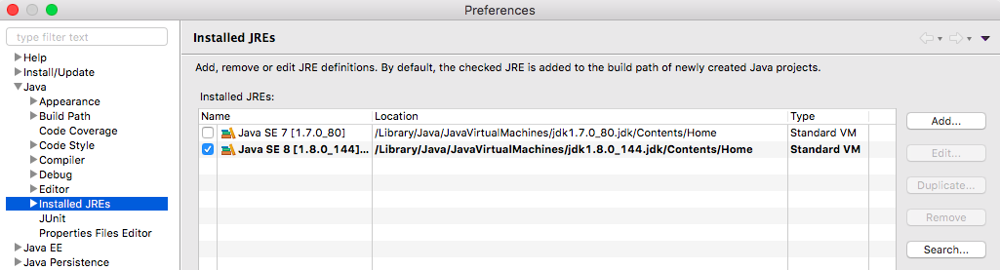
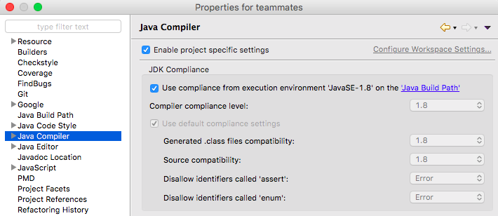
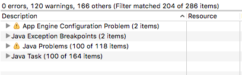
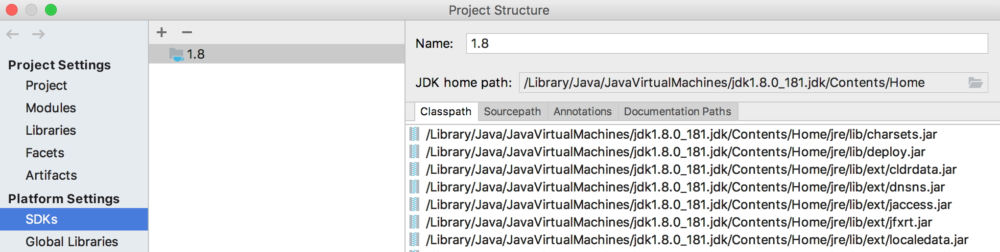
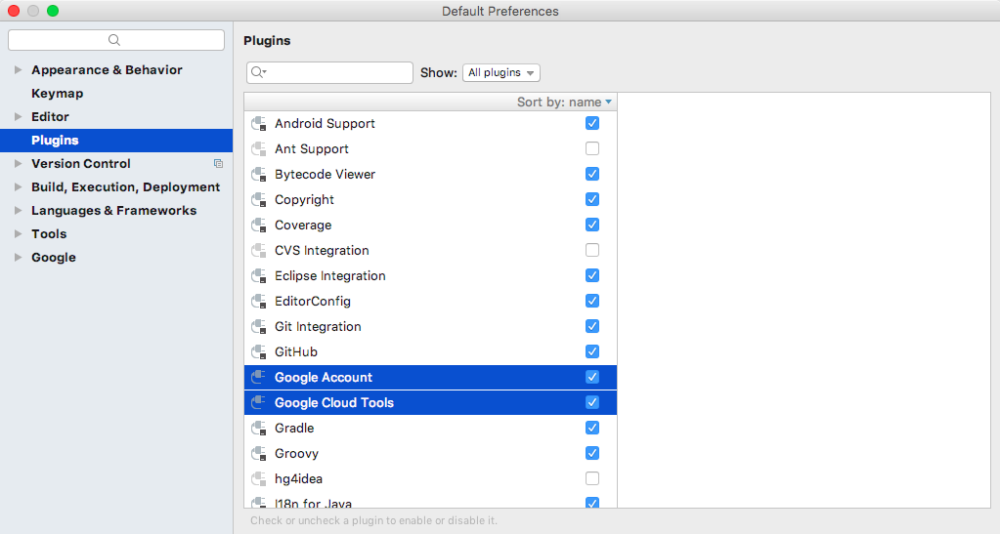
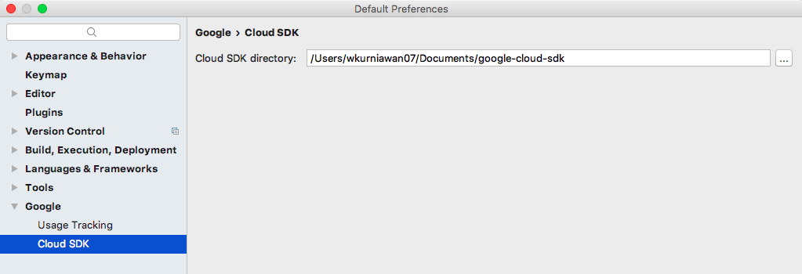

# Set up an IDE

- [Eclipse IDE](#eclipse-ide)
- [IntelliJ IDEA](#intellij-idea)

## Eclipse IDE

> - Replace all references of `Eclipse → Preferences → ...` to `Window → Preferences → ...` if you are using Windows or Linux.
> - If you worry that these settings will interfere with your other projects, you can use a separate Eclipse instance for TEAMMATES.

Supported Eclipse versions: [Eclipse IDE for Java EE Developers version Neon or Oxygen](http://www.eclipse.org/downloads/).

### Prerequisites

1. You need the following plugins:
   * [Buildship Gradle Integration](https://marketplace.eclipse.org/content/buildship-gradle-integration)
   * [Google Cloud Tools for Eclipse](http://marketplace.eclipse.org/content/google-cloud-tools-eclipse)
   * [TestNG for Eclipse](https://marketplace.eclipse.org/content/testng-eclipse)

   

   

1. Before importing the project into Eclipse, do the following:
   * Google Cloud Tools: Go to `Eclipse → Preferences → Google Cloud Tools` and fill the `SDK location` box with the directory of your installed Google Cloud SDK.

     

   * JRE: Go to `Eclipse → Preferences → Java → Installed JRE` and ensure a **JDK 1.8** (not JRE) entry exists.

     

     Note that the JDK to be used is not required to be the `default`.

### Project Setup

1. Run this command to get the necessary configuration files for Eclipse:

   ```sh
   ./gradlew setupEclipse
   ```

   **Verification:** The folder `.launches` and files `.classpath`, `.project` should be added to the project root directory.

1. Import the project into your Eclipse instance.
   * Go to `File → Import...`.
   * Under `Gradle`, select `Existing Gradle Project`. Click `Next >`.
   * Set the `Project root directory` to the location where the repository is cloned. Click `Next >`.
   * If necessary, tick `Override workspace settings` and choose `Gradle wrapper`. Click `Finish`.

   After importing the project, you may see many errors/warnings on your marker tab.
   These will be resolved in the next step.

1. Configure the following project-specific settings (all can be found in `Project → Properties → ...`, except for the HTML, CSS and XML settings which can be found in `Eclipse → Preferences → ...`):
   * Text encoding: `UTF-8` is used for text encoding.
     Configure for all the languages used in TEAMMATES in `Eclipse → Preferences → ...`. Change the encoding to `UTF-8` if it is not the default value.
     * General: `General → Workspace → Text file encoding`.
     * HTML: `Web → HTML Files → Encoding`. Alternatively, tick `Use workspace encoding`.
     * CSS: `Web → CSS Files → Encoding`.
     * JSP: `Web → JSP Files → Encoding`.
     * XML: `XML → XML Files → Encoding`.

   * JDK: `Java Build Path → Libraries` → ensure that the system library used is JDK 8.

     

   * Compiler compliance: `Java Compiler` → tick `Use compliance from execution environment 'JavaSE-1.8' on the 'Java Build Path'`.

     

   * Indentation: 4 spaces are used in place of tabs for indentations. For JSON, HTML, and HTML-like documents, 2 spaces are used instead.
     Configure for all the languages used in TEAMMATES:
     * Java: `Java → Code Style → Formatter → Edit → Tab policy → Spaces only`.
     * JavaScript: `JavaScript → Code Style → Formatter → Edit → Tab policy → Spaces only`.
     
     You can find the Web, XML, and JSON options in `Eclipse → Preferences → ...`.
     * HTML: `Web → HTML Files → Editor → Indent using spaces`.
     * CSS: `Web → CSS Files → Editor → Indent using spaces`.
     * XML: `XML → XML Files → Editor → Indent using spaces`.
     * JSON: `JSON → JSON Files → Editor → Indent using spaces`.

   * Validation: Go to `Validation → ...`
     * Disable validation for HTML, JSP, and XML: Uncheck the `Build` option for `HTML Syntax Validator`, `JSP Content Validator`, `JSP Syntax Validator`, `XML Schema Validator`, and `XML Validator`.
     * Disable validation for JavaScript and JSON files in `node_modules` folder: Click the `...` settings button for `JavaScript Validation` → if `Exclude Group` is not already in the list then click `Add Exclude Group...` → `Exclude Group` → `Add Rule...` → `Folder or file name` → `Next` → `Browse Folder...` → navigate to the `node_modules` folder and confirm → `Finish`. The steps for disabling the `JSON Validator`are similar.

1. `Refresh` and `Clean` the project for all changes to take effect. Ensure that there are no errors. Warnings are generally fine and can be ignored.

   

   > If you are using Eclipse Neon, you will find that all declarations of `import` and `export` in JavaScript files are marked as errors. This is fine and is not a cause for concern.

1. To set up some static analysis tools, refer to [this document](static-analysis.md).

1. To move on to the development phase, refer to [this document](development.md)

> Note: It is not encouraged to run Gradle tasks via Eclipse.

## IntelliJ IDEA

> - Replace all references of `IntelliJ IDEA → Preferences` to `File → Settings` if you are using Windows or Linux.

Supported IntelliJ versions: IntelliJ IDEA Ultimate Edition (required to work with Google App Engine).
You can sign up for the free [JetBrains student license](https://www.jetbrains.com/student/) if you are a student registered in an educational institution.

### Prerequisites

1. You need a Java 8 SDK with the name `1.8` defined in IntelliJ IDEA as follows:

   * Click `Configure → Project Defaults → Project Structure` (or `File → Project Structure` if a project is open).
     Select SDKs in Platform Settings and check if there is an SDK named `1.8` with a JDK home path pointing to a JDK 8 path.
     Otherwise, add a new SDK using JDK 8 with a name of `1.8`.
     

1. You need the [Google Cloud Tools](https://cloud.google.com/tools/intellij/docs/quickstart-IDEA#install) plugin installed and configured:

   
   * During installation, you may encounter a prompt to disable the obsolete `Google App Engine Integration` plugin. Answer `Yes`.
   * After installation, restart IntelliJ IDEA and configure the plugin.
     Click `Configure → Settings/Preferences` (or `IntelliJ IDEA → Preferences` if a project is open),
     go to `Other Settings → Google → Cloud SDK`, and select your Google Cloud SDK directory.
     

### Project Setup

1. Import the project as a Gradle project as follows:
   1. Click `Import Project` (or `File → New → Project from Existing Sources...` if a project is open).
   1. Select the local repository folder and click `Open`.
   1. Select `Import project from external model` and then `Gradle`.
   1. Click `Next`.
   1. Check `Use auto-import` and uncheck `Create separate module per source set`.
   1. Ensure `Create directories for empty content root automatically` is unchecked.
   1. Ensure `Use default gradle wrapper` is selected.
   1. Ensure for `Gradle JVM:` that a JDK 8 with a name of `1.8` is selected.
   1. Click `Finish`. Wait for the indexing process to complete.
   1. You should see a dialog box with the message:\
      `Framework detected: Google App Engine Standard framework is detected.`.\
      **OR**\
      `Frameworks detected: Web, Google App Engine Standard frameworks are detected`.\
      Click on `Configure` and ensure that only the `Google App Engine Standard` framework is shown, then click `OK`.
      If there are other frameworks shown, click `Cancel` and wait until indexing is completed, then try again.
      > If you closed or missed the dialog box, go to `View → Tool Windows → Event Log`.
        You should see the same message as the message in the dialog box. Click `Configure` and then `OK`.

1. Configure the following project-specific settings (all can be found in `IntelliJ IDEA → Preferences → ...`):

   * Indentation: 4 spaces are used in place of tabs for indentations. For JSON, HTML, and HTML-like documents, 2 spaces are used instead.
     Configure for all the languages used in TEAMMATES:
     1. Go to `Editor → Code Style`.
     1. Select `Project` for `Scheme` if you do not wish to make the settings the default for your IDE.
     1. For `Java`, `JavaScript`, `JSON`, `CSS`, `XML`, `HTML`, and `JSP`:
        * Ensure that `Use tab character` is unchecked, and `Tab size:`, `Indent:`, and `Continuation indent:` are `4`, `4`, and `8` respectively.
        * For `HTML`, `JSON`, and `JSP`, the numbers are `2`, `2`, and `4` instead.

   * Text encoding: `UTF-8` is used for text encoding.
     Go to `Editor → File Encodings` and ensure that `Project Encoding` and `Default Encoding for properties files` is set to `UTF-8`.

   * JavaScript: Go to `Languages & Frameworks → JavaScript` and select `ECMAScript 6` for the `JavaScript language version`.

1. Click `OK`.

1. Run this command to set up the run configurations for IntelliJ:

   ```sh
   ./gradlew setupIntellij
   ```

1. To set up some static analysis tools, refer to [this document](static-analysis.md).

1. To move on to the development phase, refer to [this document](development.md).
