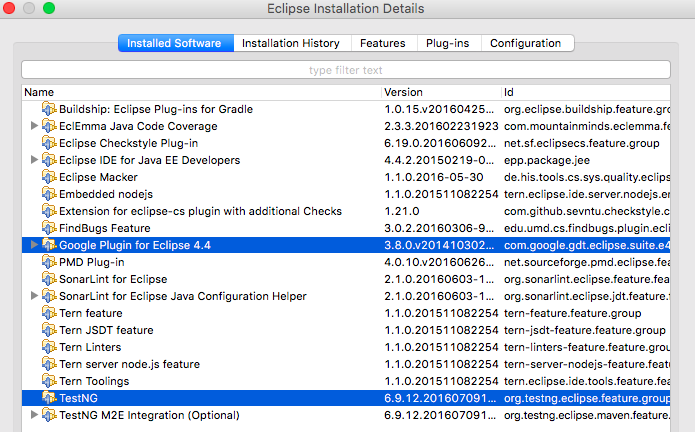
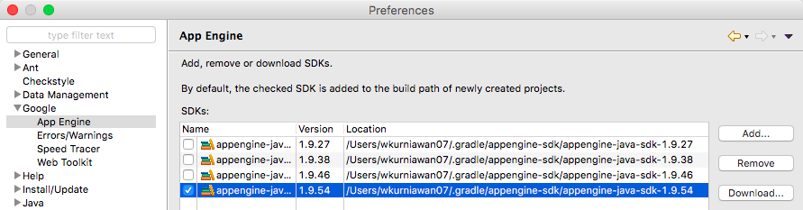
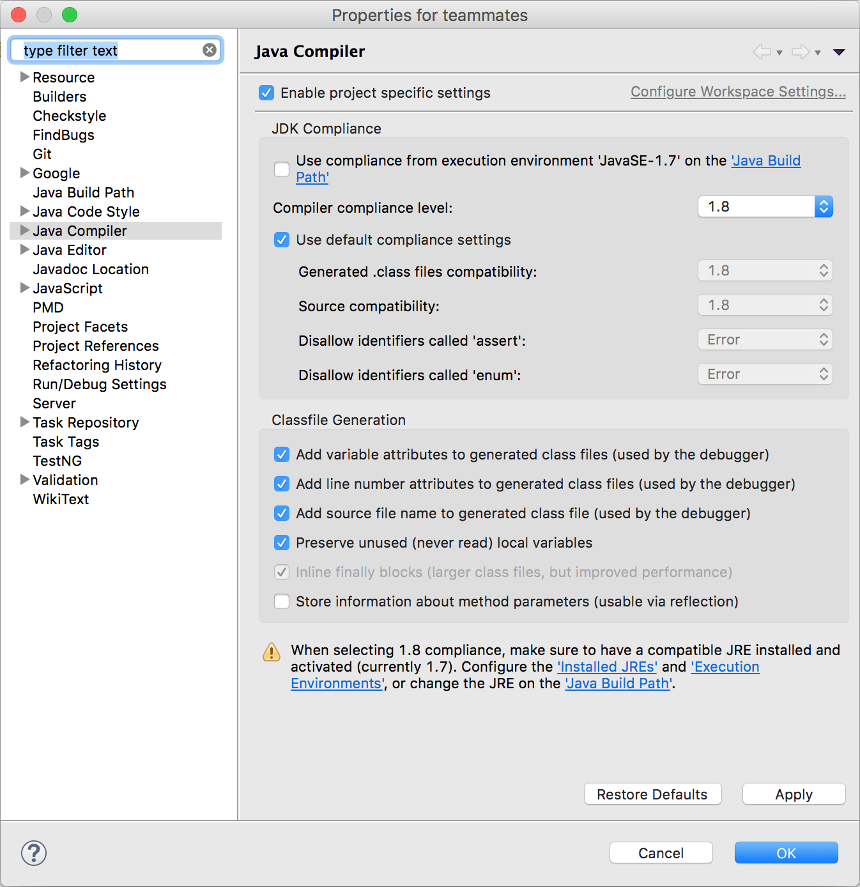
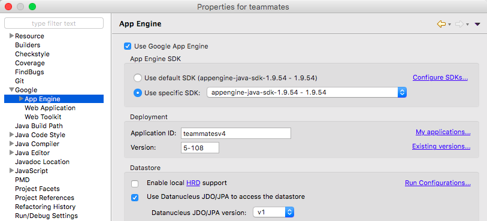
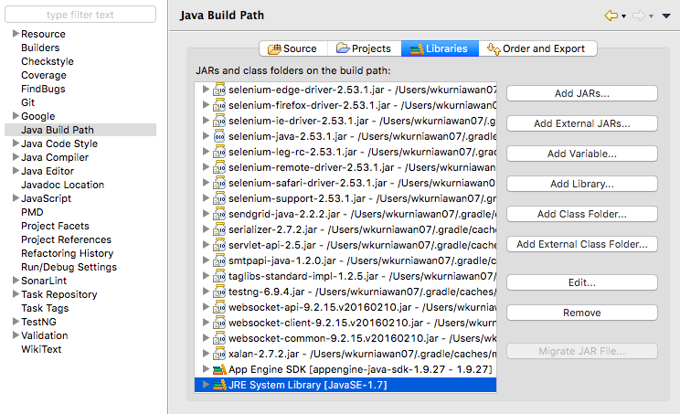

# Using an IDE

## Eclipse IDE

> - Replace all references of `Eclipse → Preferences → ...` to `Window → Preferences → ...` if you are using Windows.
> - If you worry that these settings will interfere with your other projects, you can use a separate Eclipse instance for TEAMMATES.

Supported Eclipse versions: [Eclipse IDE for Java EE Developers version Luna, Mars, or Neon](http://www.eclipse.org/downloads/).

The following plugins are needed:
* [Google Plugin for Eclipse](https://developers.google.com/eclipse/docs/download): the correct version for your Eclipse IDE.
* [TestNG Eclipse plugin](http://testng.org/doc/download.html): latest stable.



1. Run this command to get necessary configuration files for Eclipse:

   ```sh
   ./gradlew setupEclipse
   ```

   **Verification:** The files `.project` and `.classpath` should be added to the project root directory.

1. Start Eclipse and do the following works before importing the project:
   * Google App Engine: Go to `Eclipse → Preferences → Google → App Engine`, click the `Add` button, and point it to where Gradle keeps the downloaded SDK.<br>
     This directory can be found by running the command `./gradlew printUserHomeDir`.<br>
     Further instructions for installing can be found [here](https://developers.google.com/eclipse/docs/using_sdks).

     

   * JRE: Go to `Eclipse → Preferences → Java → Installed JRE` and ensure a **JDK 1.7** (not JRE, not JDK 1.8) entry exists.

     

   Note that none of the App Engine SDK or JDK to be used are required to be the `default`.

1. Import the project to your Eclipse instance.
   * Go to `File → Import...`.
   * Select `Existing Projects into Workspace` under `General`.
   * Set the `root directory` to the location where the repo is cloned.
   * Click `Finish`.

1. Configure the following project-specific settings (all can be found in `Project → Properties → ...`):
   * Text encoding: `Resources` → change the `Text file encoding` setting from `Default` to `Other: UTF-8`.

     

   * Google App Engine: set up the following by going to `Google → ...`:
     * Datanucleus version: `App Engine → Datastore → Datanucleus JDO/JPA Version` → select `v1`.

       

     * ORM Enhancement: `App Engine → ORM` → clear all the entries, and add the following entry: `src/main/java/teammates/storage/entity/*.java`.
     * Validation exclusion: `App Engine → Validation` → add two entries: `src/test/java` and `src/client/java`.
     * WAR directory: `Web Application` → tick both `This project has a WAR directory` and `Launch and deploy from this directory`, and enter `src/main/webapp` as `WAR directory`.
   * JDK: `Java Build Path → Libraries` → ensure that the system library used is JDK 7.

       

   * Compiler compliance: `Java Compiler` → tick `Use compliance from execution environment 'JavaSE-1.7' on the 'Java Build Path'`.

       

   * Indentation: In TEAMMATES, we use 4 spaces in place of tabs for indentations.
     Configure for all the languages used in TEAMMATES:
     * Java: `Java → Code Style → Formatter → Edit → Tab policy → Spaces only`.
     * JavaScript: `JavaScript → Code Style → Formatter → Edit → Tab policy → Spaces only`.
     * HTML: `Web → HTML Files → Editor → Indent using spaces`.
     * CSS: `Web → CSS Files → Editor → Indent using spaces`.
     * XML: `XML → XML Files → Editor → Indent using spaces`.
   * Validation: We do not validate HTML, JSP, and XML.<br>
     `Validation` → uncheck the `Build` option for `HTML Syntax Validator`, `JSP Content Validator`, `JSP Syntax Validator`, and `XML Validator`.

1. `Clean` the project for all changes to take effect. Ensure that there are no errors. Warnings are generally fine and can be ignored.

   

1. To set up some static analysis tools, refer to [this document](staticAnalysis.md).

## IntelliJ IDEA

Supported IntelliJ versions: IntelliJ IDEA Ultimate Edition (required to work with Google App Engine).
You can sign up for the free [JetBrains student license](https://www.jetbrains.com/student/) if you are a student registered in an educational institution.

1. If you are an existing IntelliJ user and have a project open, close the project (`File → Close Project`) before continuing.

1. Configure IntelliJ as follows:
   * JRE: Click `Configure → Project Defaults → Project Structure`. Under `Project SDK`, click `New → JDK`. Locate the `Java` folder where you have installed `JDK 1.7`. Select `jdk1.7.*` and click `OK`.
   * Indentation: In TEAMMATES, we use 4 spaces in place of tabs for indentation. Go to `Configure → Settings → Editor → Code Style` and ensure that `Use tab character` is unchecked for `Java`, `JavaScript`, `HTML`, `CSS` and `XML`.
   * Text Encoding: Go to `Configure → Settings → Editor → File Encodings` and ensure that `IDE Encoding` and `Project Encoding` are set to `UTF-8`.
   * HTML/JSP syntax: We prefer not to use the HTML/JSP Inspections provided by IntelliJ. Go to `Configure → Settings → Editor → Inspections` and uncheck `HTML` and `JSP Inspections`.

1. Import the project into IntelliJ.
   * Click `Import project` and select the local repository folder.
   * Click `Import project from external model → Gradle`.
   * Click `Next`.
   * Check `Use auto-import`. Ensure that `1.7` is used for the `Gradle JVM`.
   * Click `Finish`.

1. In your `Event Log`, you should see this line: `Frameworks detected: Google App Engine, Web, JPA frameworks are detected in the project`. Click `Configure` and `OK` in the dialog box that appears.

1. Run this command to set up the necessary configuration files for IntelliJ:

   ```sh
   ./gradlew setupIntellij
   ```

1. To set up some static analysis tools, refer to [this document](staticAnalysis.md).
