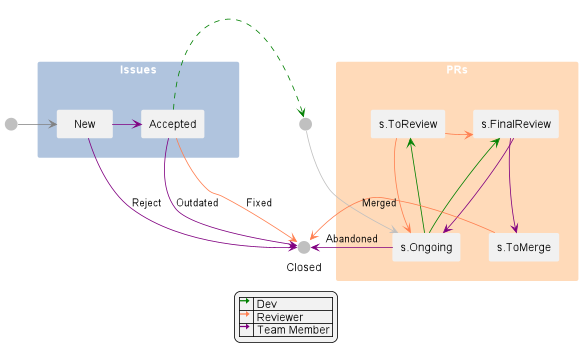

# Issue tracker

This document describes how the issue tracker is used by the TEAMMATES project.

* [Issue lifecycle](#issue-lifecycle)
* [Issue labels](#issue-labels)

## Issue lifecycle

Given above is an illustration of the issue lifecycle.
Colors indicate which roles are involved in which states/transitions.

## Issue labels

This portion will only describe the purpose of each *label group* briefly.
The full description of each individual label can be viewed under the [labels page](https://github.com/TEAMMATES/teammates/labels).

* **Status (`s.*`)**: Classifies issues and PRs based on **status**
  * No `s.*` label and no other labels in issue: issue is yet to be triaged
  * No `s.*` label and other labels present in issue: issue is accepted
* **Category (`c.*`)**: Classifies issues and PRs based on **type of work done**
* **Priority (`p.*`)**: Classifies issues based on **importance**, as determined by the project maintainers
* **Difficulty Level (`d.*`)**: Classifies issues based on **difficulty level**
  * No `d.*` label: variable difficulty level, typically between `d.Contributors` and `d.Committers` level
* **Aspect (`a-*`)**: Classifies issues based on the **non-functional aspect**
  * No `a-*` label: no specific aspect tackled, usually the case for enhancements or new features
* **Feature (`f-*`)**: Classifies issues based on the **functional aspect**
  * No `f-*` label: no specific feature tackled, usually the case for refactoring
* **Technology (`t-*`)**: Classifies issues based on the **technology/tool stack** involved
  * No `t-*` label: usually documentation update, or mixture of many languages
* **Effort Estimate (`e.*`)**: Indicates the **estimated number of hours** needed to work on the issue
  * `e.n`: `n` hours estimated effort, e.g. `e.1` is 1 hour, `e.2` is 2 hours, etc.
