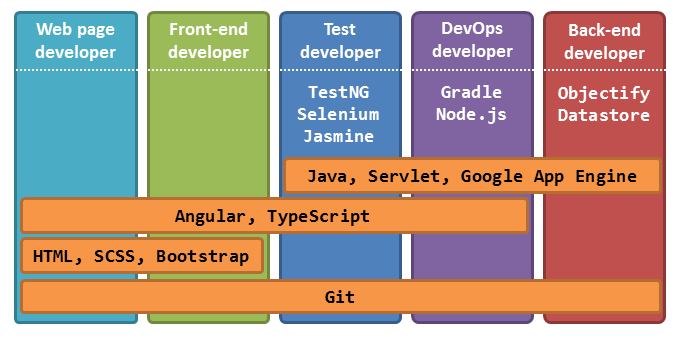

# **Contributor Orientation Guide**

We welcome contributions from anyone, in particular, students (see [here](https://teammatesv4.appspot.com/about.jsp) for a list of our contributors). One of the main objectives of TEAMMATES is to help students get experience in a OSS production environment. Here are some information that might be useful to would-be contributors.

* [Knowledge required](#knowledge-required)
* [Getting started](#getting-started)
* [Orientation task list](#orientation-task-list)
* [Contacting us](#contacting-us)

## Knowledge required

Although TEAMMATES uses many tools and technologies, you need not know all of them before you can contribute. The diagram below shows which technologies you need to learn to contribute in different roles.

As you can see, some roles do not involve learning any technologies at all.
Note that these role are not fixed or formally assigned; it is simply for guidance only.

Roles:

* **Tester**: Tests the App manually and reports bugs or suggestions for enhancements in the issue tracker.
* **Copy editor**: Helps in improving documentation.
* **Web page developer**: Works on static web pages, such as those used in the TEAMMATES product web site.
* **Test developer**: Works on automating system tests.
* **Frontend developer**: Works on the frontend of the App that is generated dynamically from the server side.
* **Backend developer**: Works on the backend logic of the App, including data storage.

## Getting started

Contributing to an OSS project requires you to figure out things on your own when you can, and seek help from the right resource (Google, StackOverflow, troubleshooting guides, issue tracker, etc.) when you cannot. To become a TEAMMATES contributor, you need to start honing those skills. 
To help you with that, we have created a sequence of tasks you can try to complete. Try to complete as many of them as you can, in the order they are listed. 
Of course we are happy to guide you if you encounter any difficulties when doing these tasks; we have provided a [troubleshooting guide](troubleshooting-guide.md) for some commonly faced problems. Failing that, you may post a help request in our [issue tracker](https://github.com/TEAMMATES/teammates/issues).

> - The task descriptions are brief by intention. We want you to try to figure out how to do those things by yourself.
> - While the dev team members will be glad to answer your questions, you will not make a good impression if you ask questions which are already answered in the mentioned resources.

## Orientation task list

### **Phase A**: Know the project

1. Understand what TEAMMATES is about.
   * [product intro page](https://teammatesv4.appspot.com) shown to potential users
   * [project vision, challenges, and principles](overview.md)
   * [feature overview](https://teammatesv4.appspot.com/features.jsp) (users’ point of view)

1. Decide in which role(s) you want to contribute, i.e. tester, copy-editor, etc. as specified [earlier in this document](#knowledge-required).
   * If you are aiming only for tech writer or tester roles, get an instructor account using the link in the TEAMMATES home page. Remember to mention the purpose of your request under "Any other comments/queries". If you are sure you want to become a contributor, you can skip this step and move to Phase B, where you get to set up TEAMMATES on your own machine and use that instance to try the functionality.

### **Phase B**: Set up locally

1. [Set up TEAMMATES development environment on your computer.](setting-up.md) 
   **Important: Follow instructions to the letter. Install the specified versions of the tool stack, not the latest versions.**
1. [Optional but recommended] [Set up the TEAMMATES project in an IDE](ide-setup.md).
1. Get the test to pass (more info in [_Development Guidelines_ document](development.md)). It is OK to proceed to the next phase if you have fewer than 5 failing test cases.

### **Phase C**: Learn and start contributing

In order to contribute effectively, you are advised to learn how to do the various development routines lined out in [the _Development Guidelines_ document](development.md). Try your best to be familiar with at least building and testing the application in your local development environment.

When you are ready for a real contribution, you are advised to start with an issue labelled [d.FirstTimers](https://github.com/TEAMMATES/teammates/issues?q=is:issue+is:open+label:d.FirstTimers) (but do not do more than one of those), then move on to other issues labelled [d.Contributors](https://github.com/TEAMMATES/teammates/issues?q=is:issue+is:open+label:d.Contributors).
Steps for fixing an issue are lined out in the [process document](process.md).

> In the event that you cannot find a `d.FirstTimers`-labelled issue, you can start with a `d.Contributors`-labelled issue.
> You can consult the `e.*` label, if it is present, to estimate the difficulty. Lower number generally means less amount of work required.

### **Important**

Fixing an issue quickly is not the important thing. In fact, issues given to new contributors are the ones we already know how to fix.
We are more interested to see how you go about fixing the issue. We want to know whether you are systematic and detail-oriented.

Take your time to learn and follow the workflow to the letter. Do not skip any steps because you think that step is "not important". We are more impressed when you finish an issue in fewer attempts than when you finish it in a shorter time but take many attempts because you were not meticulous enough along the way.

## Contacting us

The best way to contact us is to [post a message in our issue tracker](https://github.com/TEAMMATES/teammates/issues/new). Our issue tracker doubles as a discussion forum. You can use it for things like asking questions about the project or requesting technical help.

Alternatively (less preferred), you can email us at **teammates@comp.nus.edu.sg**.
