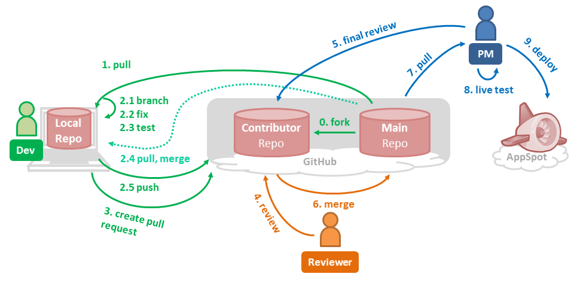

# Development Workflow

This is the project-wide development workflow for TEAMMATES.

* [Overview](#overview)
* [Fixing issues](#fixing-issues)
* [Reviewing a PR](#reviewing-a-pr)
* [Merging a PR](#merging-a-pr)

## Overview



* This workflow is an adaptation of the [GitHub flow](https://guides.github.com/introduction/flow/).
* If you need any help regarding the workflow, please [post a new issue in our issue tracker](https://github.com/TEAMMATES/teammates/issues/new).
* It is assumed that the development environment has been correctly set up. If this step has not been completed, refer to [this document](setting-up.md).<br>
  You are also encouraged to be reasonably familiar with how to [work with your own local copy of TEAMMATES](development.md).

The following are the roles involved:
* **Dev**: fixing issues
* **Reviewer**: reviewing pull requests (PRs); usually a core team member
* **Code quality reviewer**: approving PRs; usually the Project Manager

> *Roles* are related to the development process and they are different from *Positions*, which relate to the organization structure of the TEAMMATES developer community.

## Fixing issues

**Role: Dev**

This instruction set will use the issue `Remove unnecessary System.out.printlns from Java files #3942` as an example.

### Step 1: Pick an issue to fix

Our issue tracker contains bug reports, feature requests, as well as suggestions for enhancements.
You are free to work on any of the issues listed there.

* If you are a contributor, there is no need to get the issue assigned to you.
* If you are a core team member, assign the issue to yourself and assign it a milestone.
  You are expected to open a PR for this issue within a week; inactivity for a longer time may result in the issue being un-assigned so that someone else can work on it.
* While not required, the following gestures are appreciated:
  * Indicating your interest in working on any particular issue by commenting on the issue thread itself.
  * Refraining from working on issues that are assigned to someone else or have open PRs.
* (Optional) You can discuss, via the issue tracker, the alternative solutions before choosing one to implement.
  Such a discussion reduces the chance of a rejected fix or a misunderstood issue.

The [issue labels](issues.md#issue-labels) may help you in choosing which issue to fix.

### Step 2: Start clean from a new branch

1. Start off from your `master` branch and make sure it is up-to-date with the latest version of the main repo's `master` branch.
   ```sh
   git checkout master
   git pull
   ```

1. Create a new branch to push your commits into. If you have commit access and need to push into the main repo for some reason, name it `{IssueNumber}-{some-keywords}`,
   where `some-keywords` are representative keywords taken from the issue title.
   ```sh
   git checkout -b 3942-remove-unnecessary-println
   ```

Notes:

1. **Do not** combine fixes for multiple issues in one branch, unless they are tightly related.
1. Your `master` branch must never be ahead of the main repo's `master` branch at all times.

### Step 3: Fix the issue

> If this is your first issue, you may want to look at our coding and testing best practices as well as coding conventions (links given [here](README.md)).

Make the changes to the code, tests, and documentations as needed by the issue.

1. Commit the changes to your branch.
   ```sh
   git add -A
   git commit
   ```
   * You may commit as many times as you wish while you are making the changes.
     It is, however, a good idea to commit at meaningful points to keep your branch reasonably clean.
   * Use meaningful commit messages (e.g. `Add tests for the truncate method`).
     [Here](http://chris.beams.io/posts/git-commit/) is a good reference.

1. Sync with the main repo frequently. While you were fixing the issue, others might have pushed new code to the main repo.
   * Update your repo's `master` branch with any new changes from main repo, then switch back to your work branch.

     ```sh
     git checkout master
     git pull
     git checkout 3942-remove-unnecessary-println
     ```
   * Option 1: merge those updates to the branch you are working on.

     ```sh
     git merge master
     ```
   * Option 2: if you are confident with rebasing, rebase your changes over the latest `master` branch.

     ```sh
     git rebase master
     ```
   * If there are updates to the dependencies on the build configuration, you should update your local copies accordingly.
     The details on the steps can be found on [this document](dependencies.md).

1. <a name="things-to-check"></a>Before submitting your work for review, here are some things to check (non-exhaustive):
   * The code is **properly formatted for readability**.
   * The code base passes **static analysis** (i.e. code quality check):

     ```sh
     ./gradlew lint
     npm run lint
     ```
   * **Dev green**, i.e. all *local tests* are passing on your dev server.<br>
     You are more than welcome to also ensure all *CI tests* are passing on your dev server.
   * **Staging-tested (if need be)**: If your new code might behave differently on a remote server than how it behaves on the dev server,
     ensure that the affected tests are passing against the updated app running on your own GAE staging server.
   * **No unrelated changes** are introduced in the branch. This includes unnecessary formatting changes.
   * All changes or additions to functional code are **accompanied by changes or additions in tests**, even if they are absent before.
   * All new public APIs (methods, classes) are **documented with header comments**.
   * **Documentations are updated** when necessary, particularly when there are changes or additions to software design as well as user-facing features.

1. Push your branch to your fork, or to the main repo only if necessary.
   ```sh
   git push {remote-name} 3942-remove-unnecessary-println
   ```
   If the above command does not work e.g. because of rebasing, do a forced-push:
   ```sh
   git push -f {remote-name} 3942-remove-unnecessary-println
   ```

   > Anyone working on an issue, including core team members, should use branches in his/her own fork instead unless the branch needs to be in the main repo.
   > Such cases include:
   >
   > * The branch is being worked on by multiple people.
   > * The branch contains changes that need to be trialled by other core team member.

### Step 4: Submit a PR

[Create a PR](https://help.github.com/articles/creating-a-pull-request/) with the following configuration:
* The base branch is the main repo's `master` branch (except for hot patches in which it will be the `release` branch).
* PR name: copy-and-paste the relevant issue name and include the issue number as well,
  e.g. `Remove unnecessary System.out.printlns from Java files #3942`.
* PR description: mention the issue number in this format: `Fixes #3942`.
  Doing so will [automatically close the related issue once the PR is merged](https://github.com/blog/1506-closing-issues-via-pull-requests).
* You are encouraged to describe the changes you have made in your branch and how they resolve the issue.

It is not required that you submit a PR only when your work is ready for review;
make it clear in the PR (e.g. in the description, in a comment, or as an `s.*` label) whether it is still a work-in-progress or is ready for review.

### Step 5: Following up

Once a PR is opened, try and complete it within 2 weeks, or at least stay actively working on it.
Inactivity for a long period may necessitate a closure of the PR.

The following labels are used to indicate status of PRs:
* `s.Ongoing`: the PR is being worked on
* `s.ToReview`: the PR is waiting for review
* `s.ToMerge`: reviewer has accepted the changes
* `s.MergeApproved`: code quality reviewer has approved the merge; PR ready to be merged
* `s.OnHold`: the work on the PR has been put on hold pending some other event; this label is to be used as needed

#### Code review

Your code will be reviewed, in this sequence, by:
* Travis CI: by running static analysis.<br>
  If there are problems found, the build will terminate without proceeding to testing.<br>
  Most of the tools will display the cause of the failures in the console;
  if this is not the case, you can run any of the static analysis tools and obtain the reports locally.<br>
  Ensure that the static analysis passes before triggering another build.
* Travis CI: by building and running tests.<br>
  If there are failed tests, the build will be marked as a failure.
  You can consult the CI log to find which tests.<br>
  Ensure that all tests pass before triggering another build.
  * The CI log will also contain the command that will enable running the failed tests locally.
* Reviewer: a core team member will be assigned to the PR as its reviewer, who will approve your PR (`s.ToMerge`) or suggest changes (`s.Ongoing`).
  Feel free to add a comment if:
  * a reviewer is not assigned within 24 hours.
  * the PR does not get any review within 48 hours of review request.
  * you want to clarify or discuss about the suggestions given by your reviewer.
* Code quality reviewer: final review for maintainability and style.

#### Updating the PR

If you are tasked to update your PR either by Travis CI or by your reviewer, **do not** close the PR and open a new one.
You should make and push the updates to the same branch used in the PR, essentially repeating [step 3](#step-3-fix-the-issue).

Remember to add a comment to indicate the PR is ready for review again, e.g. `Ready for review` or `Changes made`.
If you have permission to change labels, you may additionally change the `s.*` PR label as appropriate.

The cycle of "code review" - "updating the PR" will be repeated until your PR is approved by all the parties involved (`s.MergeApproved`).

### Step 6: Prepare for merging

The core team member responsible for merging your PR might contact you for reasons such as syncing your PR with the latest `master` branch or resolving merge conflicts.
Depending on the situation, this may necessitate more changes to be made in your PR (e.g. if your PR is functionally conflicting with a recent change), however this rarely happens.

Your work on the issue is done when your PR is successfully merged to the main repo's `master` or `release` branch.

## Reviewing a PR

**Role: Reviewer**

> - The reviewer of a PR is the assignee of it.
> - To remove whitespace-only changes from being shown, append `?w=1` to url of the `/files` page of the PR (the "Files changed" tab).

[GitHub's review feature](https://github.com/blog/2256-a-whole-new-github-universe-announcing-new-tools-forums-and-features#code-better-with-reviews) is to be used in this task.

* Ensure that the Travis CI build is successful and the developer has local dev green.
* Ensure the following:
  * Naming conventions for PR and branch are followed, and `Fixes #....` or similar keyword is present in the PR description.
  * The items in [this list](#things-to-check) are all satisfied.
  * The solution is the best possible solution to the problem under the circumstances.
  * The code is up-to-date with the latest `master` branch, or at least no conflict.
    If this is not the case, ask the dev to sync with it with the latest `master` branch.
* If any of the above are not OK:
  * Add comments in the diff to suggest changes.
    Bundle the review comments with the "Start a review" and "Add review comment" features, and finish it with "Request changes", preferably with the review summary.
  * Change the status of the PR to `s.Ongoing`.
* If the code is OK in all aspects, change the PR status to `s.ToMerge` and "Approve" the PR.

**Role: Code quality reviewer**

* Review the code for maintainability and style.
* The follow-up action is the same as that of reviewers, with the only difference being the label to be applied is `s.MergeApproved`.

## Merging a PR

**Role: dev (with push permission), or reviewer**

This instruction set will use the issue `Remove unnecessary System.out.printlns from Java files #3942`, resolved by PR `#3944`, as an example.

* Merging can be done anytime as long as the `s.MergeApproved` label is present and GitHub gives a green light for merging.
  There are a few scenarios where GitHub can prevent merging from proceeding:
  * **Merge conflict**: the PR is conflicting with the current `master` branch; the author will need to resolve the conflicts before proceeding.
  * **Outdated branch**: the PR is not in sync with the current `master` branch; the author will need to sync it before proceeding.

  The dev will need to resolve them before merging can proceed. It is up to the dev/reviewer's discretion on whether the merge conflict or outdated branch necessitates another review.<br>
  In general, unless the changeset is functionally conflicting, there is no need for another review.
* When ready for merging,
  * Checkout to the PR branch and test the code locally by running the "Local tests".

    ```sh
    git checkout -b 3942-remove-unnecessary-println {remote-name}/3942-remove-unnecessary-println
    ```
  * If green,
    * Merge with ["Squash and merge"](https://github.com/blog/2141-squash-your-commits) option (preferable). Format of the commit message:

      ```
      [#Issue number] Issue title as given in the original issue (#PR number)
      ```
      e.g. `[#3942] Remove unnecessary System.out.printlns from Java files (#3944)`.
    * Apply an `e.*` label to the issue (not the PR) to indicate the estimated effort required to fix the issue,
      and another `e.*` label to the PR to indicate the estimated effort required to review the PR.<br>
      `e.1` is roughly equal to an hour of work, `e.2` is two hours of work, and so on.
  * If not green,
    * Change the PR status back to `s.Ongoing`.
    * Add a comment to mention the test failure(s).
