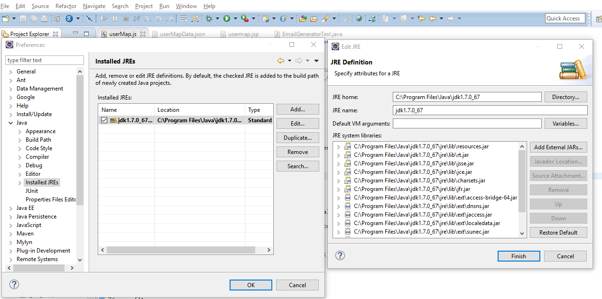

# Setting up a development environment

This is a step-by-step guide to setting up a development environment in your local machine.
You will use that environment to work on features, enhancements, bug fixes, etc. which ultimately allows you to contribute to the project.

The instructions in all parts of this document work for Linux, OS X, and Windows, with the following pointers:
- Replace `./gradlew` to `gradlew.bat` if you are using Windows.
- All the commands are assumed to be run from the root project folder, unless otherwise specified.
- When a version is specified for any tool, install that version instead of the latest version available.

> If you encounter any problems during the setting up process, please refer to our [troubleshooting guide](troubleshooting-guide.md) before posting a help request in our [issue tracker](https://github.com/TEAMMATES/teammates/issues).

## Step 1: Install necessary tools and languages

1. Install Git, and (optional but recommended) a Git GUI client such as GitHub for Windows/Mac.
1. Install JDK 1.7.

## Step 2: Obtain your own repository copy

1. Fork our repo at https://github.com/TEAMMATES/teammates. Clone that fork to your hard disk.

1. Add a remote name (e.g `upstream`) for the original repo for your repo to keep in sync with.
   ```sh
   git remote add upstream https://github.com/TEAMMATES/teammates.git
   ```
  
 **Verification:** Use the command `git remote -v` and the following lines should be part of the output:

  ```
    upstream        https://github.com/TEAMMATES/teammates.git (fetch)
    upstream        https://github.com/TEAMMATES/teammates.git (push)
  ```

1. Set your `master` branch to track the original repo's `master` branch.
   ```sh
   git checkout master
   git branch -u upstream/master
   ```

More information can be found at [this documentation](https://help.github.com/articles/fork-a-repo/).

## Step 3: Set up project-specific settings and dependencies

1. Run this command to download the correct version Google App Engine SDK as used in the project:
   ```sh
   ./gradlew appengineDownloadSdk
   ```
   
 **Verification:** Check your Gradle folder (the directory can be found with the command `./gradlew printUserHomeDir`). A folder named `appengine-sdk` should be present.
 
1. Run this command to create the main config files (these are not under revision control because their contents vary from developer to developer):
   ```sh
   ./gradlew setup
   ```

 **Verification:** The file named `.project` should be added to the project root directory.

1. Modify the following config files:
   * `gradle.properties`<br>
      If you want to use a JDK other than the one specified in your PATH variable, add the value to the variable `org.gradle.java.home`.
      This value must be a valid **JDK 1.7** directory.
   * `src/test/resources/test.properties`<br>
      Append a **same** unique id (e.g your name) to **each** of the default accounts found at the bottom of this file,
      e.g change `test.student1.account=alice.tmms` to `test.student1.account=alice.tmms.KevinChan`.

## Step 4: Set up Eclipse IDE

Eclipse IDE is our preferred development environment. Support requests related to other IDEs will not be entertained.

> Replace all references of `Eclipse → Preferences → ...` to `Window → Preferences → ...` if you are using Windows.

1. Download [Eclipse IDE for Java EE Developers](http://www.eclipse.org/downloads/) version Luna, Mars, or Neon, and install the following plugins:
   * [Google Plugin for Eclipse](https://developers.google.com/eclipse/docs/download). Use the correct version for your Eclipse IDE.<br>
     Be careful to omit other plugins shown on the screen (e.g Google App Engine Tools for Android, GWT plugin).
   * The latest stable [TestNG Eclipse plugin](http://testng.org/doc/download.html).
   
   **Verification:** You can check if the plugins were installed successfully by going to `Help → Installation Details`.

1. Configure Eclipse as follows (if you worry that these settings will interfere with your other projects, you can use a separate Eclipse instance for TEAMMATES):
   * Google App Engine: Go to `Eclipse → Preferences → Google → App Engine`, click the `Add` button, and point it to where Gradle keeps the downloaded SDK.<br>
     This directory can be found by running the command `./gradlew printUserHomeDir`.<br>
     Further instructions for installing can be found [here](https://developers.google.com/eclipse/docs/using_sdks).
   * Text encoding: Go to `Eclipse → Preferences → General → Workspace`, change the `Text file encoding` setting from `Default` to `Other: UTF-8`.
   * JRE: Go to `Eclipse → Preferences → Java → Installed JRE` and ensure a JDK (not a JRE) is selected (use **JDK 1.7**, as recommended by GAE).
     One of the items in the [troubleshooting guide](troubleshooting-guide.md) explains how to do this.
     
   **Verification:** Go to `Eclipse → Preferences → Java → Installed JREs`, select the JDK 1.7 entry, and choose Edit. It should result in something like this:
      
     
   * Indentation: In TEAMMATES, we use 4 spaces in place of tabs for indentations.
     Go to `Eclipse → Preferences` and configure for all the languages used in TEAMMATES:
     * Java: `Java → Code Style → Formatter → Edit → Tab policy → Spaces only`
     * JavaScript: `JavaScript → Code Style → Formatter → Edit → Tab policy → Spaces only`
     * HTML: `Web → HTML Files → Editor → Indent using spaces`
     * CSS: `Web → CSS Files → Editor → Indent using spaces`
     * XML: `XML → XML Files → Editor → Indent using spaces`
  * HTML/JSP syntax: We prefer not to use the HTML/JSP syntax validator provided by Eclipse.<br>
    To turn it off, go to `Project → Properties → Validation → HTML Syntax Validator` and uncheck the `Build` option. Similarly for `JSP Content Validator` and `JSP Syntax Validator`.

1. Run this command to download the dependencies required by TEAMMATES and configure them up to be used by Eclipse:
   ```sh
   ./gradlew resetEclipseDeps
   ```
   This command can be run again whenever the dependencies need to be updated.
  
 **Verification:** The file named `.classpath` should be added to the project root directory.

1. Import the project to your Eclipse instance.
   * Start Eclipse and go to `File → Import...`.
   * Select `Existing Projects into Workspace` under `General`.
   * Set the `root directory` to the location where the repo is cloned.
   * Click `Finish`.

If you followed every step correctly, you should have successfully set up the development environment.
You may proceed to the development routine as lined out in [this document](development.md).

## Step 5: (Optional) Set up static analysis tools

TEAMMATES uses a number of static analysis tools in order to maintain code quality and measure code coverage.
It is highly encouraged to set up these tools in your local development environment.

Refer to [this document](staticAnalysis.md) for details on the tools used, how to set them up, and how to run them locally.
