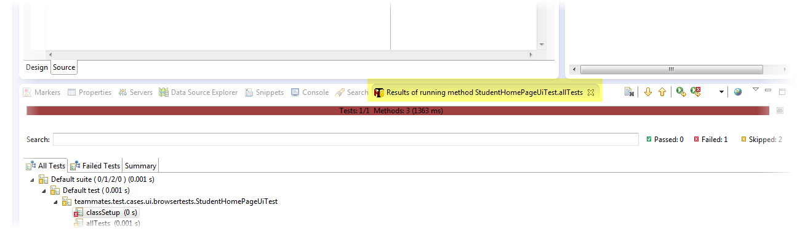
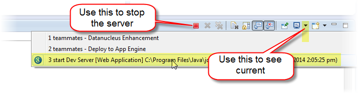

# Developer Troubleshooting Guide

This document can help you to fix the common problems encountered while contributing to TEAMMATES.
Note that some of the screenshots might be outdated, but the instructions will remain the same and all necessary modifications will be explained.

* [Troubleshooting project setup](#troubleshooting-project-setup)
    * [Common setup errors and solutions](#common-setup-errors-and-solutions)
* [Troubleshooting test failures](#troubleshooting-test-failures)
    * [Optimizing IDE layout for testing](#optimizing-ide-layout-for-testing)
    * [How automated browser tests work](#how-automated-browser-tests-work)
    * [Common test errors and solutions](#common-test-errors-and-solutions)
* [Submitting help request](#submitting-help-request)

## Troubleshooting project setup

### Common setup errors and solutions

* **ERROR**: After downloading and installing Google Cloud SDK, running any `gcloud` command results in `gcloud: command not found` or alike.

  **REASON**: You did not choose to update the `PATH` variable when installing the SDK.

  **SOLUTION**: You can re-run the install command again without any side effect. Make sure to choose to update the `PATH` variable this time. Alternatively, you can use other appropriate methods to update your `PATH` variable to include the `/bin` sub-folder of the SDK folder. 
  To verify this, try running any `gcloud` command and it should now give you access to the SDK.

* **ERROR**: Eclipse complains "...your project must be configured to use a JDK in order to use JSP".

  **REASON**: This happens because Eclipse is only aware of JRE, not JDK (Compiling JSP requires the JDK).

  Go to `Window → Preferences → Java → Installed JREs`. You will note that a JRE path is the one selected, not a JDK path.

  **SOLUTION**: To fix this, Click `Add → Standard VM`, then for the JRE Path enter the path of the JRE folder inside your JDK installation folder, e.g. `C:/jdk1.8/jre`. Now you should see all of the JARs added to the library section.

* **ERROR**: When trying to deploy, Eclipse complains "... Cannot get the System Java Compiler. Please use a JDK, not a JRE.".

  **SOLUTION**: You can force Eclipse to use the JDK (instead of JRE) by modifying the `eclipse.ini` file. See [here](http://stackoverflow.com/questions/13913019/changing-jdk-in-eclipse) for more details.

* **ERROR (on Windows)**: Dev server launched by Eclipse keeps running even after closing Eclipse. After restarting Eclipse, you will be able to relaunch dev server on the same port but requests will be received by the previous server instance.

  **REASON**: If Eclipse crashes while dev server is running inside Eclipse, the server might keep running even after Eclipse is closed.

  **SOLUTION**: Go to Windows Task Manager and kill processes named `javaw.exe`.

* **ERROR**: Eclipse complains "file out of sync".

  **SOLUTION**: "Refresh" the project in Eclipse.

* **ERROR**: Eclipse complains "There are no JREs installed in the workplace that are strictly compatible with this environment.".

  **REASON**: Eclipse may be using an incompatible version of the JRE Library (with respect to TEAMMATES) for the current JRE definition. System Library for JRE should be set to the workspace default, after an appropriate JRE definition has been added (covered in existing point#2 of the troubleshooting section).

  **SOLUTION**: Right-click on project → Properties → Java Build Path → "Libraries" tab → Select JRE System Library from the list → Edit… → Select and mark radio button for "Workspace default JRE".

* **ERROR**: Eclipse complains "NewClass cannot be resolved to a type", "The import some.package.NewClass cannot be resolved", or "The method someMethod() from the type ExistingClass refers to the missing type NewClass" after syncing with `master` branch.

  **SOLUTION**: This is likely because the dependencies have changed. Refer to [this document](dependencies.md) for steps to update your local dependencies configuration.

* **ERROR**: Some characters are displayed incorrectly in the browser. For example, `Charlés's` is displayed as `Charlés`.

  **REASON**: Page encoding is not set to UTF-8.

  **SOLUTION**: In Eclipse, go to `Window` → `Preferences` → `Resources` → change the `Text file encoding` setting from `Default` to `Other: UTF-8`. If this does not fix the error, you can try the methods in [this link](https://z0ltan.wordpress.com/2011/12/25/changing-the-encoding-in-eclipse-to-utf-8-howto/).

## Troubleshooting test failures

### Optimizing IDE layout for testing

The default place for the TestNG tab is alongside the Console tab.

Here is a better place for it. Just drag the tab and drop it alongside the Project Explorer tab.

### How automated browser tests work

Our automated Browser tests compare generated Web pages with expected pages (these are in the `src/test/resources/pages` folder). Such test cases fails when the expected page does not match the actual page. To see the diff between actual and expected, double click the error message in the TestNG tab.

Here is an example (use the zoom feature of the Browser to see details of the screenshot):

Note that you can ignore the following differences reported by Eclipse diff tool. Those are not the cause of the test failure.

Expected | Actual | Explanation
--- | --- | ---
`<expected></expected>` | `<actual></actual>` | These are inserted by the test code for easier reference, after the comparison has been done.

Furthermore, you might see tags such as `${test.student1}` and `${version}` in some of the expected files (e.g. `studentHomeHTML.html`) if you open them in Eclipse. The test code will replace those tags with correct values before performing the comparison. For example, `${version}` will be replaced by something like `6.0.0`.

### Common test errors and solutions

* **ERROR**: Encountered `java.net.ConnectException: Connection refused` when running some tests.

  **SOLUTION**: Ensure that your dev server is started prior to running those tests.

* **ERROR**: Encountered `org.openqa.selenium.WebDriverException: Unable to bind to locking port 7054 within 45000 ms` when running tests with Browser.

  **SOLUTION**: Ensure compatible version of Firefox is installed as specified under [Development process document](development.md#testing).

* **ERROR**: Tests fail randomly during dev server testing.

  **SOLUTION**: Make sure there is only one dev server running. Eclipse will happily allow you to start multiple dev servers.

  

* **ERROR**: Test failure message encountered when running full test suite: "Selenium cannot find Firefox binary in PATH".

  **REASON 1**: Path to Firefox executable on local machine is incorrect.

  **SOLUTION 1 (on Windows)**: Specify the correct folder in system PATH variable.

  Open Windows Explorer → Right-click on Computer → Advanced System Settings → "Advanced" tab → Environment Variables… → Select "PATH" from the list → Add directory of "Mozilla Firefox" folder to "Variable value" field.

  **REASON 2**: Incorrect custom path in `test.firefox.path`.

  **SOLUTION 2**: Make sure that the path is set correctly following the example from `test.template.properties`.

* **ERROR**: A handful of failed test cases (< 10).

  **SOLUTION**: Re-run the failed tests with TestNG, all test cases should pass eventually (it may take a few runs). If there are tests that persistently fail and not addressed in other parts of this guide, you may [request for help in the issue tracker](https://github.com/TEAMMATES/teammates/issues/new).

* **ERROR**: Tests fail due to accented characters.

  **SOLUTION**: Ensure that the text file encoding for your Eclipse workspace has been set to `UTF-8` as specified under [Setting up guide](setting-up.md).

* **ERROR**: Error message in the console about "incorrect date format".

  **SOLUTION**: Ensure the date format of your computer matches the below. For Windows, [this link](http://www.sevenforums.com/tutorials/3530-time-format-change.html) may be useful.

  

* **ERROR**: `InstructorCourseDetailsPageUiTest` fails in production server due to Gmail's access restriction (e.g `javax.mail.AuthenticationFailedException`)

  **SOLUTION**: ["Allow access for less secure apps"](https://support.google.com/accounts/answer/6010255?hl=en) for the accounts used in that particular test. As doing so will leave the accounts more vulnerable to security issues, it is strongly recommended that the access is revoked after the test passes.

* **ERROR (on Linux)**: `java.io.IOException: Directory "/tmpfiles" could not be created`.

   **SOLUTION**: Add `-Djava.io.tmpdir=/path/to/teammates/tmp` for the tests' run configurations. The "tmp" folder in the specified directory needs to be created before running the tests.

## Submitting help request

If none of the items in this guide helps with the problem you face, you can [post in the issue tracker](https://github.com/TEAMMATES/teammates/issues/new) to request for help.
Remember to supply as much relevant information as possible when requestng for help, e.g.:

1. Step in the setting up guide that you are in (if you are setting up the project), or which tests are failing (if you are resolving test failures)
1. Error messages shown on the console (or from the TestNG tab if resolving test failures)
1. What measures you have taken to address the problem
1. Operating system, JDK version, Eclipse version, Firefox version (where applicable)
1. Screenshots (if any)
